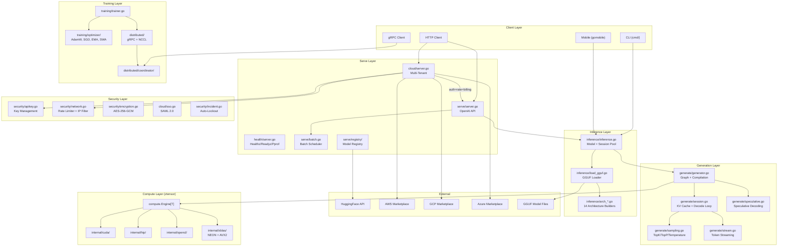

# Deep Review Report -- Zerfoo ML Framework

**Date:** 2026-03-23
**Scope:** Full codebase (`github.com/zerfoo/zerfoo`)
**Reviewer:** Automated deep review (Claude Opus 4.6)

---

## Executive Summary

Zerfoo is a well-architected, production-grade ML inference and training framework with clean package layering, proper dependency injection via functional options, and comprehensive test coverage (573 test files). The inference pipeline is performant (245 tok/s Gemma 3 1B Q4_K_M) with CUDA graph capture covering 99.5% of decode instructions.

**Highest-risk finding:** The cloud billing middleware completely fails to capture streaming (SSE) responses, allowing any client to set `"stream": true` and consume unlimited inference with zero billing or budget enforcement (Critical). Combined with the `responseCapture` wrapper not implementing `http.Flusher`, SSE streaming is broken for all cloud-served endpoints.

**Most impactful architectural recommendation:** The serve/server.go God file (1046 lines) should be split into middleware.go, handlers.go, types.go, and streaming.go. Additionally, the marketplace API clients need retry logic with exponential backoff -- a single failed metering call silently loses revenue.

---

## System Architecture Map



---

## Critical and High Findings

### [Critical] C1 -- Streaming Responses Bypass Cloud Billing Completely

**Location:** `cloud/server.go:120-153`, `serve/cloud/billing.go:87-133`

**Description:** Both billing middleware implementations capture the response body and parse it as JSON to extract `usage.prompt_tokens` and `usage.completion_tokens`. Streaming (SSE) responses never produce a single JSON body -- they emit `data: {"choices":[...]}` chunks followed by `data: [DONE]`. The `json.Unmarshal` fails silently, and the early return on line 140 of `cloud/server.go` skips all billing.

**Exploitation:** A client sets `"stream": true` on every request. Tokens are consumed (GPU compute, KV cache) but zero billing records are generated and zero tokens are deducted from the tenant's budget. This is a direct revenue loss vector.

**Fix:**
```go
// Instrument the generation layer to report token counts directly,
// rather than parsing HTTP response bodies. In generate/session.go,
// track actual token counts and surface them via context or callback.
// As an interim fix, count SSE data chunks and estimate token usage:

if reqParsed.Stream {
    input = estimatePromptTokens(reqBody.Bytes())
    output = countSSEChunks(capture.body)
} else {
    // existing JSON parsing
}
```

---

### [Critical] C2 -- SAML Signature Verification Missing

**Location:** `cloud/sso.go:180`

**Description:** `ValidateAssertion` parses SAML assertions and checks expiry but never verifies the XML digital signature against the IdP certificate. The comment on line 179 explicitly states: "In production, this would also verify the XML signature against the IdP certificate."

**Exploitation:** An attacker crafts a SAML response with any `NameID` (e.g., admin), valid timestamps, and submits it. Without signature verification, the system accepts it, granting full access.

**Fix:**
```go
import "github.com/russellhaering/goxmldsig"

func (p *SAMLProvider) ValidateAssertion(assertion []byte) (*SSOIdentity, error) {
    certDER, err := base64.StdEncoding.DecodeString(strings.TrimSpace(p.metadata.Certificate))
    if err != nil { return nil, fmt.Errorf("cloud: decode IdP cert: %w", err) }
    cert, err := x509.ParseCertificate(certDER)
    if err != nil { return nil, fmt.Errorf("cloud: parse IdP cert: %w", err) }

    ctx := dsig.NewDefaultValidationContext(&dsig.MemoryX509CertificateStore{
        Roots: []*x509.Certificate{cert},
    })
    if _, err = ctx.Validate(assertion); err != nil {
        return nil, fmt.Errorf("cloud: SAML signature verification failed: %w", err)
    }
    // ... rest of existing parsing logic ...
}
```

---

### [Critical] C3 -- Support API Completely Unauthenticated

**Location:** `support/api.go:19-25`

**Description:** All five support API endpoints have zero authentication or authorization. `RegisterRoutes` adds them directly to the mux with no middleware.

**Exploitation:** Anyone can enumerate tickets via `GET /support/tickets?customer_id=...`, create tickets under any customer ID, close any ticket, and add comments with any claimed author.

**Fix:**
```go
func (a *API) RegisterRoutes(mux *http.ServeMux) {
    // Wrap all support routes with auth middleware:
    // mux.Handle("/support/", authMiddleware(supportMux))
    // Each handler must verify: authenticatedTenant.ID == customerID
}
```

---

### [Critical] C4 -- Differential Privacy Uses Hardcoded Seed

**Location:** `federated/dp.go:37`

**Description:** `DPStrategy` uses `math/rand` seeded with hardcoded value `42`. Noise is entirely deterministic and predictable, completely defeating the differential privacy guarantee.

**Exploitation:** An adversary computes the exact noise sequence, subtracts it from aggregated updates, and recovers raw gradients enabling gradient inversion attacks to reconstruct individual client training data.

**Fix:**
```go
import crand "crypto/rand"

func NewDPStrategy(inner Strategy, config DPConfig) *DPStrategy {
    var seed [8]byte
    crand.Read(seed[:])
    return &DPStrategy{
        inner:  inner, config: config,
        rng:    rand.New(rand.NewSource(int64(binary.LittleEndian.Uint64(seed[:])))),
        accountant: &PrivacyAccountant{},
    }
}
```

---

### [Critical] C5 -- Pprof Debug Endpoints Exposed Without Authentication

**Location:** `health/server.go:56-60`

**Description:** `/debug/pprof/` endpoints are unconditionally registered with no authentication. They expose heap dumps (containing API keys, tokens, user data in memory), goroutine stacks (file paths, line numbers), CPU profiles, and command-line arguments.

**Exploitation:** `GET /debug/pprof/heap` downloads a heap dump containing plaintext API keys and tenant data. `/debug/pprof/cmdline` may reveal secrets passed as command-line flags.

**Fix:**
```go
func (s *Server) Handler() http.Handler {
    mux := http.NewServeMux()
    mux.HandleFunc("/healthz", s.handleHealthz)
    mux.HandleFunc("/readyz", s.handleReadyz)
    // Remove pprof from public health server.
    // Expose on a separate localhost-only admin port if needed.
    return mux
}
```

---

### [High] H1 -- SAML XXE (Billion Laughs) DoS

**Location:** `cloud/sso.go:83-86, 182`

**Description:** `ParseSAMLMetadata` and `ValidateAssertion` use `xml.Unmarshal` on untrusted input. Go's XML decoder processes internal entity expansion, enabling exponential memory consumption.

**Fix:**
```go
if bytes.Contains(data, []byte("<!DOCTYPE")) || bytes.Contains(data, []byte("<!ENTITY")) {
    return nil, errors.New("cloud: XML DOCTYPE/ENTITY declarations not permitted")
}
```

---

### [High] H2 -- SAML NotBefore Not Enforced + No Replay Protection

**Location:** `cloud/sso.go:190-221`

**Description:** `NotBefore` timestamp is parsed but never validated. No assertion ID tracking exists, allowing unlimited replay within the `NotOnOrAfter` window.

**Fix:** Parse and validate `NotBefore` with clock skew tolerance. Track assertion IDs in a `sync.Map` keyed by assertion ID with TTL expiry.

---

### [High] H3 -- No Scope/Authorization Enforcement on Any Endpoint

**Location:** `serve/server.go:231-252`

**Description:** `authMiddleware` validates the Bearer token but never checks scopes. `DELETE /v1/models/{id}` has no admin check -- any authenticated user can unload the model, causing DoS for all users.

**Fix:** Look up the key in `KeyStore`, call `key.HasScope(security.ScopeAdmin)` for destructive operations.

---

### [High] H4 -- Empty API Key Silently Disables All Authentication

**Location:** `serve/server.go:174`

**Description:** When `apiKey == ""` (e.g., missing env var), auth middleware is completely skipped with no warning. The entire API is exposed unauthenticated.

**Fix:** Log a loud warning or refuse to start without explicit opt-in for no-auth mode.

---

### [High] H5 -- Rate Limiter Bypass via X-Forwarded-For Spoofing

**Location:** `security/network.go:167-174`

**Description:** `ClientIP()` blindly trusts `X-Forwarded-For`. An attacker rotates fake IPs to get fresh rate limit buckets on every request.

**Fix:** Only trust proxy headers from known reverse proxies. Fall back to `r.RemoteAddr` for direct connections.

---

### [High] H6 -- Token Budget Not Checked Before Request Execution

**Location:** `cloud/server.go:120-153`

**Description:** `ConsumeTokens()` is called AFTER the request completes. The return value (indicating budget exceeded) is discarded. Tenants consume unlimited tokens post-response.

**Fix:** Pre-authorize a token reservation before serving; reconcile actual usage afterward.

---

### [High] H7 -- Model DELETE Races with Inference Handlers

**Location:** `serve/server.go:820-844, 522-524`

**Description:** `handleChatCompletions`, `handleCompletions`, and `handleEmbeddings` do not check `s.unloaded` before calling `s.inflight.Add(1)`. Requests that arrive after DELETE sets `unloaded=true` but before `s.model.Close()` will use a closed model.

**Fix:** Add `if s.unloaded.Load() { writeError(w, 503, "model has been unloaded"); return }` before `inflight.Add(1)` in all three handlers. Use `sync.RWMutex` for full correctness.

---

### [High] H8 -- Webhook Signature Validation Skipped When Secret Empty

**Location:** `marketplace/azure/webhook.go:88-94`

**Description:** When `h.Secret` is empty, signature validation is completely skipped. Attackers can forge subscription lifecycle events.

**Fix:** Make signature validation mandatory; return 500 if secret is unconfigured.

---

### [High] H9 -- GKE Cluster Missing Private Cluster + Master Authorized Networks

**Location:** `infra/terraform/zerfoo-cloud/main.tf:50-77`

**Description:** The Kubernetes API server is publicly accessible by default. No `private_cluster_config` or `master_authorized_networks_config` is set.

**Fix:** Enable `private_cluster_config` with `enable_private_nodes = true` and restrict `master_authorized_networks_config` to VPC CIDR.

---

### [High] H10 -- Tenant API Keys Stored as Plaintext in Memory

**Location:** `cloud/tenant.go:38`

**Description:** `Tenant.APIKey` stores the raw key, unlike `security/apikey.go` which stores SHA-256 hashes. A heap dump would expose all tenant keys.

**Fix:** Store only SHA-256 hashes, similar to `security/apikey.go`.

---

### [High] H11 -- No Retry Logic in Marketplace Metering Clients

**Location:** `marketplace/aws/metering.go:167-199`, `marketplace/azure/metering.go:131-174`, `marketplace/gcp/metering.go`

**Description:** All marketplace API clients have zero retry logic. A single failed `BatchMeterUsage` call silently loses billing data. Cloud metering APIs are throttled and transient errors are expected.

**Fix:** Add exponential backoff retry with jitter (3 retries, 1s/2s/4s base).

---

### [High] H12 -- Batch Path Destroys Chat Template Formatting

**Location:** `serve/server.go:611-622`

**Description:** When `BatchScheduler` is attached, chat completions concatenates raw message content with spaces, bypassing the model's chat template (e.g., Gemma `<start_of_turn>`, Llama `<|start_header_id|>`). Batched chat produces incoherent model input.

**Fix:** Apply `s.model.FormatMessages(messages)` instead of raw concatenation.

---

### [High] H13 -- Cloud responseCapture Breaks SSE Streaming

**Location:** `cloud/server.go:156-171`

**Description:** `responseCapture` does not implement `http.Flusher`. When the inner handler checks for `Flusher` support, it fails, falling through to `writeError(w, 500, "streaming not supported")`. SSE streaming is broken for all cloud-served endpoints.

**Fix:** Implement `Flush()` on `responseCapture` by delegating to the wrapped `ResponseWriter`.

---

### [High] H14 -- DP Config Parameters Not Validated

**Location:** `federated/dp.go:33`

**Description:** `NewDPStrategy` accepts `DPConfig` without validating `Epsilon > 0`, `Delta in (0,1)`, or `ClipNorm > 0`. `Epsilon=0` causes division by zero. `Delta >= 1` makes the DP guarantee vacuous.

**Fix:** Validate all DPConfig parameters in the constructor.

---

### [High] H15 -- O(n) Linear Scan for Tenant API Key Lookup

**Location:** `cloud/tenant.go:170-179`

**Description:** Despite having a `byAPIKey` map, `GetByAPIKey` iterates ALL tenants with constant-time comparison. The map is populated but never used for lookups. O(n) per request.

**Fix:** Use the `byAPIKey` map for O(1) lookup.

---

## Security Findings (Medium/Low/Info)

### Injection & Input Validation

| # | Severity | Location | Finding |
|---|----------|----------|---------|
| M1 | Medium | `support/api.go:36-66` | Support API endpoints missing `MaxBytesReader` body size limits |
| M2 | Medium | `marketplace/azure/webhook.go:82` | Webhook handler `io.ReadAll` with no size limit |
| M3 | Medium | `serve/server.go:860-883` | Embeddings endpoint accepts unbounded `input` array; add batch size cap |
| M4 | Medium | `registry/pull.go:154,181` | HuggingFace URLs constructed from user-controlled model ID without SSRF protection |
| M5 | Medium | `support/webhook.go:100-106` | Webhook dispatcher sends to user-registered URLs without SSRF validation |
| L1 | Low | `serve/server.go:563-571` | Temperature/TopP/TopK not range-validated; negative temperature causes NaN |
| L2 | Low | `serve/server.go:209-213` | X-Request-Id echoed verbatim; validate format and length |
| L3 | Low | Multiple marketplace files | Unbounded `io.ReadAll` on external API responses |

### Authentication & Authorization

| # | Severity | Location | Finding |
|---|----------|----------|---------|
| M6 | Medium | `distributed/tlsconfig.go` | TLS optional for distributed training; no worker authentication by default |
| M7 | Medium | `serve/cloud/tenant.go:132-141` | `TenantRegistry.Get()` uses non-constant-time map lookup (timing side-channel) |
| L4 | Low | `cloud/server.go:179` | Bearer prefix is case-sensitive; minor RFC 6750 non-compliance |

### Cryptography & Data Exposure

| # | Severity | Location | Finding |
|---|----------|----------|---------|
| M8 | Medium | `security/encryption.go:17` | `Encrypt()` accepts 16/24-byte keys despite documenting AES-256-only |
| M9 | Medium | `federated/dp.go:154-158` | Privacy budget (delta) accumulates without upper bound check |
| M10 | Medium | `security/apikey.go:55-59` | KeyStore is in-memory only; revocations lost on restart |
| M11 | Medium | `provenance/provenance.go:92` | Hash chain siblings are reorderable; no sequence number |
| L5 | Low | `serve/server.go:533` | JSON parse errors leak Go struct field names to clients |
| L6 | Low | `cloud/tenant.go:29` | `TenantConfig.APIKey` has JSON tag; could leak if serialized |

### Infrastructure & Configuration

| # | Severity | Location | Finding |
|---|----------|----------|---------|
| M12 | Medium | `serve/server.go:186-193` | Missing CSP, HSTS, Referrer-Policy security headers |
| M13 | Medium | `security/network.go:147-163` | CORS missing `Vary: Origin` header (cache poisoning) |
| M14 | Medium | `marketplace/azure/webhook.go:76-115` | No replay protection on webhook events |
| M15 | Medium | `infra/terraform/.../main.tf:93-95` | GKE nodes have overly broad `cloud-platform` OAuth scope |
| M16 | Medium | `deploy/helm/` (absent) | No NetworkPolicy in Helm chart |
| M17 | Medium | `deploy/aws/cloudformation.yaml:198-213` | HTTP without forced HTTPS when no certificate |
| M18 | Medium | `.github/workflows/*.yml` | GitHub Actions referenced by tag, not SHA (supply chain risk) |
| L7 | Low | `deploy/aws/Dockerfile:2,20` | Base images not pinned to SHA256 digest |
| L8 | Low | `deploy/helm/.../deployment.yaml` | Missing pod-level securityContext |

### Business Logic

| # | Severity | Location | Finding |
|---|----------|----------|---------|
| M19 | Medium | `cloud/tenant.go:66-75` | Rate limit reset race allows brief double budget at minute boundaries |
| M20 | Medium | `serve/cloud/tenant.go:49-60` | No per-request token cap in cloud tenant middleware |
| M21 | Medium | `generate/session.go:85-86` | Graph mutex held for entire generation; DoS via long requests |
| M22 | Medium | `serve/batch.go:161` | Batch scheduler uses first request's context for entire batch |
| M23 | Medium | `inference/inference.go:401-425` | Session pool uninitialized in assembleModel; unbounded session creation |
| M24 | Medium | `serve/cloud/billing.go:98-102` | Billing middleware reads unbounded request body into memory |
| L9 | Low | `cmd/cli/serve.go:162` | Graceful shutdown has no timeout; can hang indefinitely |

---

## Architectural Findings

### [High] A1 -- serve/server.go God File (1046 lines)

**Affected files:** `serve/server.go`

**Description:** Contains HTTP types, all API handlers, streaming logic, 6 middleware functions, SSE streaming, and helpers. Violates SRP.

**Recommendation:** Split into `serve/middleware.go`, `serve/handlers.go`, `serve/types.go`, `serve/streaming.go`.

---

### [High] A2 -- No Health Check Handlers in Main Serve Server

**Affected files:** `serve/server.go:234`

**Description:** `/healthz` and `/readyz` are exempted from auth but never registered as handler functions. Clients get 404.

**Recommendation:** Register health handlers on the main serve mux, or document that the health server must be started separately.

---

### [High] A3 -- No Marketplace Retry Logic (Revenue Risk)

**Affected files:** `marketplace/aws/metering.go`, `marketplace/azure/metering.go`, `marketplace/gcp/metering.go`

**Description:** Zero retry logic for external metering API calls. Transient errors silently lose billing data.

**Recommendation:** Add exponential backoff retry with jitter. Consider a dead-letter queue for failed metering calls.

---

### [Medium] A4 -- God Files Throughout Codebase

**Affected files:** `generate/generator.go` (937 lines), `inference/inference.go` (921 lines), `layers/attention/grouped_query_attention.go` (1109 lines), `timeseries/patchtst.go` (1400 lines)

**Recommendation:** Extract speculative decoding from generator.go. Extract session pool from inference.go.

---

### [Medium] A5 -- Swallowed GPU/Model Errors

**Affected files:** `generate/generator.go:475`, `serve/server.go:837`, `generate/generator.go:187-191`

**Description:** GPU counter sync errors, model close errors, and BlockPool allocation failures are silently discarded.

**Recommendation:** Log all discarded errors at warn level minimum. Surface BlockPool failure to caller.

---

### [Medium] A6 -- ModelManager Holds Lock During Model Load

**Affected files:** `serve/multimodel/manager.go:86-89`

**Description:** Mutex held during `Load()` (seconds for GGUF). All concurrent `Get()` calls block.

**Recommendation:** Use `golang.org/x/sync/singleflight`.

---

### [Medium] A7 -- checkStop O(n^2) Decoding

**Affected files:** `generate/generator.go:639-653`

**Description:** `checkStop` calls `tokenizer.Decode(generatedIDs)` on every step. O(n) decode called n times = O(n^2).

**Recommendation:** Maintain a running decoded string, appending only the new token each step.

---

### [Low] A8 -- Request ID Not Propagated to Inference Layer

**Affected files:** `serve/server.go:284-314`

**Description:** Request IDs generated but never logged or passed to inference/generate layers.

---

### [Low] A9 -- Streaming Chunks Missing Required OpenAI Fields

**Affected files:** `serve/server.go:968-975, 1002-1009`

**Description:** SSE streaming chunks omit `id`, `object`, `created`, `model` fields required by the OpenAI spec.

---

### [Low] A10 -- Duplicated writeError Across Packages

**Affected files:** `cloud/server.go:185-191`, `serve/server.go:1034-1038`

---

## Functional Findings

### [High] F1 -- Batch Chat Destroys Template Formatting

**Affected files:** `serve/server.go:611-622`

**Description:** Batch scheduler concatenates raw message content with spaces, bypassing chat templates.

---

### [High] F2 -- Cloud billingMiddleware Ignores Budget Overrun

**Affected files:** `cloud/server.go:145-147`

**Description:** `ConsumeTokens()` return value discarded. Tenants exceed budget on every request.

---

### [High] F3 -- Cloud responseCapture Breaks SSE Streaming

**Affected files:** `cloud/server.go:156-171`

**Description:** `responseCapture` does not implement `http.Flusher`. All streaming through cloud server returns 500.

---

### [Medium] F4 -- isOOMError Misclassifies CUDA Errors

**Affected files:** `serve/server.go:332-338`

**Description:** `strings.Contains(msg, "cuda")` classifies all CUDA errors as OOM.

---

### [Medium] F5 -- Session Pool Hardcoded to 8

**Affected files:** `inference/load_gguf.go:115`

---

### [Medium] F6 -- AllReduce Divides by worldSize Not Actual Submissions

**Affected files:** `distributed/worker_service.go:211`

---

### [Medium] F7 -- Prefix Cache Dead Computation

**Affected files:** `generate/session.go:133-136`

---

### [Medium] F8 -- Batch Path Reports Zero Token Counts

**Affected files:** `serve/server.go:620-622`

---

### [Low] F9 -- Token Count Re-encoding Inaccuracy

**Affected files:** `inference/inference.go:530-533`

---

### [Low] F10 -- Double Softmax in TopP Sampling

**Affected files:** `generate/sampling.go:52-89, 112-125`

---

### [Low] F11 -- Billing Timestamps Not UTC

**Affected files:** `cloud/billing.go:42`

---

## Business-Critical Feature Traces

### Feature 1: Chat Completions (POST /v1/chat/completions)

**Code path:**
1. `serve/server.go:158` -- route registration
2. `serve/server.go:172-183` -- middleware: security headers -> log -> requestID -> rate limit -> auth -> recovery
3. `serve/server.go:522-693` -- `handleChatCompletions`: decode JSON, validate, clamp max_tokens, convert messages
4. `serve/server.go:603` (streaming) -> `streamChatCompletion()` at :948 -> `inference/inference.go:552` `ChatStream()` -> `GenerateStream()` at :494
5. `generate/session.go:258` -- `GenerateStream()`: encode, BOS, reset KV, prefill, decode loop with `OnToken()` callback
6. `generate/sampling.go:112` -- `sampleFromDistribution()`: softmax + weighted random

**Issues found:** F1 (batch template bypass), F8 (batch zero tokens), F9 (token re-encoding), streaming error after WriteHeader, missing `unloaded` guard.

**Test coverage:** 14 test files in serve/; good coverage of streaming, tool calls, load testing. Gap: no test for batch+chat template interaction.

---

### Feature 2: Model Loading (GGUF)

**Code path:**
1. `inference/load_gguf.go:15` -- `LoadFile()`: parse options, default device
2. `inference/load_gguf.go:22` -- `LoadGGUF(path)` -> GGUF parser
3. `inference/load_gguf.go:28` -- tokenizer extraction
4. `inference/load_gguf.go:34` -- `createEngine(device)` -> compute.Engine[float32]
5. `inference/load_gguf.go:51` -- `buildArchGraph()` -> architecture dispatch (14 architectures)
6. `inference/load_gguf.go:70-84` -- weight upload (if WeightUploader engine)
7. `inference/load_gguf.go:107-113` -- Generator creation with config
8. `inference/load_gguf.go:115-116` -- session pool (hardcoded size 8)

**Issues found:** F5 (hardcoded pool size), VocabSize=0 silent fallback.

**Test coverage:** GGUF parser has dedicated tests. Architecture builders tested via parity tests.

---

### Feature 3: Multi-Tenant Cloud Serving

**Code path:**
1. `cloud/server.go:34` -- `NewCloudServer(handler, tenants, meter)`
2. `cloud/server.go:60-64` -- mux: `/healthz` + catch-all with middleware chain
3. `cloud/server.go:80-98` -- authMiddleware: extract Bearer, resolve tenant
4. `cloud/server.go:102-117` -- rateLimitMiddleware: `tenant.AllowRequest()`
5. `cloud/server.go:121-153` -- billingMiddleware: responseCapture -> parse JSON -> ConsumeTokens + Record

**Issues found:** C1 (streaming billing bypass), H6 (budget not pre-checked), H13 (responseCapture breaks Flusher), F2 (budget overrun ignored), rate limit reset race.

**Test coverage:** Gap -- no tests for billing middleware with streaming responses.

---

### Feature 4: Distributed Training

**Code path:**
1. `cmd/cli/worker.go:35` -- parse flags, create `WorkerNode`
2. `distributed/grpc_strategy.go:77-150` -- `Init()`: connect coordinator, register, start local gRPC server, connect peers
3. `distributed/coordinator/coordinator.go:145` -- `RegisterWorker()`: assign rank, return peers
4. `distributed/grpc_strategy.go:156-174` -- `AllReduceGradients()`: rank 0 root, others worker
5. `distributed/worker_service.go:209-233` -- element-wise sum + divide by worldSize

**Issues found:** F6 (worldSize vs actual submissions), size override from caller.

**Test coverage:** Comprehensive unit and integration tests.

---

### Feature 5: Model Registry / Pull

**Code path:**
1. `cmd/cli/pull.go` -- CLI command, parse model ref
2. `registry/pull.go` -- HuggingFace API client, file listing, download
3. `modelcache/cache.go` -- local cache management with sanitized paths

**Issues found:** M4 (SSRF surface), unbounded API response reads. Path traversal well-defended.

---

## Positive Observations

1. **Clean package layering.** No circular dependencies. `serve/` correctly depends on `inference/` without importing `internal/`.

2. **Functional options pattern consistently applied.** `ServerOption`, `GeneratorOption`, `LoadOption` throughout.

3. **Interface-based design.** `compute.Engine[T]`, `MeteringService`, `BillingStore`, `AuditStore`, `EntitlementChecker`, `SSOProvider` -- all external dependencies behind interfaces.

4. **Constant-time token comparison.** `subtle.ConstantTimeCompare` used for auth in serve and cloud packages.

5. **Comprehensive path traversal defense.** Model cache, registry, repository, and pull all validate path containment.

6. **SSRF protection on vision endpoint.** `serve/vision.go:63-106` implements connect-time IP validation.

7. **Extensive test suite.** 573 test files covering serve, generate, distributed, sampling, KV cache, speculative decoding, fuzz testing.

8. **No weak crypto or InsecureSkipVerify.** TLS 1.2+ minimum. No MD5/SHA1/DES/RC4/ECB.

9. **Error sanitization.** `serve/server.go:362-372` never exposes internal details to HTTP clients.

10. **Minimal technical debt markers.** Only 3 TODO comments in production code.

---

## Statistics

- **Files read:** ~350+
- **Lines of code analyzed:** ~298,128 (Go)
- **Findings by severity:** Critical: 5, High: 15, Medium: 24, Low: 11, Info: 2
- **Architectural findings:** 10
- **Functional findings:** 11

---

## Prioritized Remediation Roadmap

### 1. Fix Immediately (security critical, data loss risk)

| # | Finding | Files to Modify | Change |
|---|---------|----------------|--------|
| 1 | C1 -- Streaming billing bypass | `cloud/server.go`, `serve/cloud/billing.go` | Instrument generation layer to report token counts; stop relying on response body parsing |
| 2 | C2 -- SAML signature missing | `cloud/sso.go` | Add XML signature verification using `goxmldsig` or equivalent |
| 3 | C3 -- Support API unauthenticated | `support/api.go` | Wrap routes with auth middleware; enforce customer_id == authenticated tenant |
| 4 | C4 -- DP hardcoded seed | `federated/dp.go` | Use `crypto/rand` for seed; validate DPConfig parameters |
| 5 | C5 -- Pprof without auth | `health/server.go` | Remove pprof from public handler; expose on localhost-only admin port |
| 6 | H4 -- Empty apiKey disables auth | `serve/server.go` | Require explicit opt-in for no-auth mode |
| 7 | H7 -- Model delete race | `serve/server.go` | Add `unloaded` check before `inflight.Add(1)` in all inference handlers |

### 2. Fix This Sprint (high-severity security, major correctness bugs)

| # | Finding | Files to Modify | Change |
|---|---------|----------------|--------|
| 8 | H1 -- SAML XXE | `cloud/sso.go` | Reject DOCTYPE/ENTITY declarations in SAML input |
| 9 | H2 -- SAML replay | `cloud/sso.go` | Add assertion ID tracking with TTL cache |
| 10 | H3 -- No scope enforcement | `serve/server.go` | Wire `KeyStore` into auth middleware; enforce scopes per endpoint |
| 11 | H5 -- X-Forwarded-For spoofing | `security/network.go` | Add trusted proxy configuration |
| 12 | H6 -- Token budget post-hoc | `cloud/server.go` | Pre-authorize tokens before serving |
| 13 | H8 -- Webhook signature optional | `marketplace/azure/webhook.go` | Make signature validation mandatory |
| 14 | H9 -- GKE public API server | `infra/terraform/.../main.tf` | Enable private cluster + master authorized networks |
| 15 | H10 -- Tenant keys plaintext | `cloud/tenant.go` | Store SHA-256 hashes only |
| 16 | H11 -- No marketplace retry | `marketplace/*/metering.go` | Add exponential backoff retry |
| 17 | H12 -- Batch template bypass | `serve/server.go` | Apply `FormatMessages()` in batch path |
| 18 | H13 -- responseCapture breaks SSE | `cloud/server.go` | Implement `http.Flusher` on `responseCapture` |
| 19 | H15 -- O(n) tenant lookup | `cloud/tenant.go` | Use `byAPIKey` map for lookups |

### 3. Fix This Quarter (architectural improvements, medium-severity issues)

| # | Finding | Files to Modify | Change |
|---|---------|----------------|--------|
| 20 | A1 -- God file | `serve/server.go` | Split into middleware, handlers, types, streaming |
| 21 | A2 -- Missing healthz handlers | `serve/server.go` | Register /healthz and /readyz on main mux |
| 22 | A5 -- Swallowed GPU errors | `generate/generator.go`, `serve/server.go` | Log discarded errors at warn level |
| 23 | A6 -- ModelManager lock during load | `serve/multimodel/manager.go` | Add singleflight wrapper |
| 24 | A7 -- checkStop O(n^2) | `generate/generator.go` | Maintain running decoded string |
| 25 | M1-M5 -- Missing body limits | `support/api.go`, `marketplace/azure/webhook.go` | Add MaxBytesReader / LimitReader |
| 26 | M12 -- Missing security headers | `serve/server.go` | Add CSP, HSTS, Referrer-Policy |
| 27 | M18 -- CI actions by tag | `.github/workflows/*.yml` | Pin all actions to commit SHA |
| 28 | F4 -- isOOMError too broad | `serve/server.go` | Match specific OOM error patterns |
| 29 | F5 -- Hardcoded session pool | `inference/load_gguf.go` | Make pool size configurable |

### 4. Track as Tech Debt (low-severity, code quality)

| # | Finding | Files to Modify | Change |
|---|---------|----------------|--------|
| 30 | L1 -- Temperature range validation | `serve/server.go` | Validate temperature/TopP/TopK ranges |
| 31 | L2 -- X-Request-Id validation | `serve/server.go` | Validate format, cap length at 128 |
| 32 | A8 -- Request ID not propagated | `serve/server.go` | Add requestID to log fields |
| 33 | A9 -- Streaming chunk fields | `serve/server.go` | Add id, object, created, model to SSE chunks |
| 34 | A10 -- Duplicated writeError | `cloud/server.go`, `serve/server.go` | Extract to shared package |
| 35 | F7 -- Prefix cache dead code | `generate/session.go` | Remove or fix dead computation |
| 36 | F10 -- Double softmax | `generate/sampling.go` | Eliminate redundant softmax allocation |
| 37 | F11 -- Billing timestamps UTC | `cloud/billing.go` | Use `time.Now().UTC()` |
| 38 | L7-L8 -- Docker/Helm hardening | `deploy/` | Pin image digests, add pod-level securityContext |
