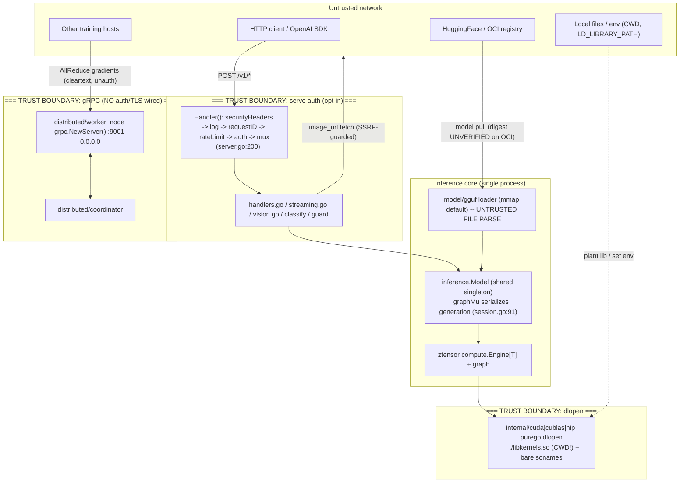

# Deep Review 002 -- Full Codebase (zerfoo core framework)

- Date: 2026-07-03 (UTC)
- Scope: `github.com/zerfoo/zerfoo` core framework (serve, inference, generate, model,
  distributed, cmd, internal, training). Cross-repo dependencies (`ztensor`, `ztoken`,
  `float16`, `float8`) referenced where a trust boundary crosses into them.
- HEAD: `5817d590` (2026-07-03). Reviewers: 5 parallel Explore agents + principal
  reviewer, with independent re-tracing of every High finding (Phase 10).
- Method: graph-assisted discovery (`.code-review-graph`, 16,856 nodes; noted stale by
  ~13 days and re-verified against source), lore checklist (`docs/lore.md` L-0001..L-0013),
  manual end-to-end tracing of the untrusted-input paths.

---

## Executive Summary

zerfoo is a **security-above-average Go ML inference/training framework**. Overall maturity
is **Level 4 (managed/consistent)** on the security axis: the HTTP server is secure-by-default
(refuses to start without an API key or an explicit `--allow-no-auth` opt-in, `cmd/cli/serve.go:141`),
uses constant-time key comparison (`serve/server.go:297`), hashes API keys with SHA-256
(`serve/security/apikey.go:142`), implements a genuinely strong connect-time SSRF defense that
defeats DNS rebinding (`serve/vision.go:63`), correctly mitigates path traversal on the model-download
path (`model/registry/pull.go:198-209`), ships textbook-correct AES-256-GCM crypto
(`serve/security/encryption.go`), leaks no secrets in tree or git history, and pins its
dependencies with no `replace` redirection. This is not a codebase with sloppy fundamentals.

The risk that remains is concentrated in three places a non-technical reader should understand.
**First, a malformed model file crashes the loader.** Model files (GGUF) are downloaded from the
internet and are explicitly untrusted by design, yet the default memory-mapped load path can be made
to panic on a crafted file through an integer-overflow that slips past the size cap
(`model/gguf/loader.go:61`, `loader_mmap.go:57`). Because Go is memory-safe this is a denial-of-service
(a crash), not remote code execution -- but a poisoned or corrupt model takes the server down on load.
**Second, the distributed-training worker listens with no authentication and no encryption**
(`distributed/worker_node.go:64`) and the shipped example binds it to all network interfaces
(`0.0.0.0:9001`); anyone who can reach that port can inject arbitrary gradients into a training run
(silent model poisoning) or read tensors in cleartext. **Third, the GPU kernel library is loaded from
the current working directory** (`internal/cuda/purego.go:167`), so an attacker who can drop a file into
the directory a zerfoo process runs from gets local code execution the moment CUDA initializes.

The single most impactful architectural recommendation is to **treat the model file and the
distributed-training wire as first-class untrusted inputs**: add hardened bounds-checking to the four
GGUF tensor-loader paths, and wire the already-written mTLS machinery (`distributed/tlsconfig.go`,
which is correct but never connected) into the worker/coordinator so the framework fails closed instead
of open. A recurring theme across findings is *good security code that exists but is never wired in*:
the rate limiter, the scoped keystore, the incident responder, and the mTLS config are all present and
correct in `serve/security/` and `distributed/`, but the shipped CLI connects none of them.

---

## Codebase Maturity Assessment

| Dimension            | Level | Evidence |
|----------------------|-------|----------|
| Security posture     | 4 | Secure-by-default serve auth (`cmd/cli/serve.go:141`), constant-time compare (`server.go:297`), SHA-256 keys (`apikey.go:142`), connect-time SSRF w/ rebinding defense (`vision.go:63`), traversal defense (`pull.go:198`). Gaps: unauth distributed worker (`worker_node.go:64`), CWD dlopen (`purego.go:167`), GGUF overflow (`loader.go:61`). |
| Code quality         | 4 | Consistent handler structure, generics discipline, clear option pattern. Some very large files (`inference/inference.go` ~890 lines, God-object tendencies in `Model`). |
| Test coverage        | 4 | 5,366 Test nodes / 7,776 functions in the graph; dedicated `fuzz_test.go`, `scope_auth_test.go`, `loadtest_test.go`, parity/golden harnesses. Gaps: no negative-fuzz corpus proven for the GGUF overflow paths. |
| Architecture         | 4 | Clean layering (serve -> inference -> generate -> model/ztensor). Engine[T] abstraction is disciplined. Smell: security capabilities implemented but unwired (rate limiter, keystore, mTLS). |
| Observability        | 3 | Structured logging w/ request IDs (`server.go:235`), Prometheus-ish collector, health/ready endpoints. Metric-name label encoding is fragile (`metrics.go:94`). |
| Error handling       | 4 | Consistent sanitization (`types.go:216`), panic recovery middleware (`server.go:395`), errors wrapped. GGUF paths panic instead of erroring on malformed input (findings F1/F2). |
| Dependency hygiene   | 4 | Deps pinned, no `replace`, `go.sum` present, distroless nonroot image. Gap: `bbolt` GO-2026-4923 unfixed and CI vuln-check is `continue-on-error`. |
| CI/CD maturity       | 3 | Most actions SHA-pinned, no `pull_request_target`, CodeQL present. Gaps: 3 workflows lack `permissions:` blocks, `govulncheck@latest` unpinned. |
| AI/Agent security    | N/A* | zerfoo IS the LLM runtime; it does not call external LLM APIs, run RAG, or orchestrate agents. Prompt/tool handling reviewed (see note). |
| Privacy/Compliance   | N/A | No PII store, no multi-tenancy, no payments, no user database. A single-model inference server. |

Overall maturity (security + architecture weighted 2x): **~3.9 / 5 (Managed)**.

*AI note: the OpenAI-compatible surface accepts prompts and "tools", but tool calls are only
*formatted* into the JSON response (`serve/tool_calls.go`, `handlers.go:493-531`) -- there is no tool
*execution*, no shell/SQL/file sink, and no agent loop. OWASP-LLM/Agentic is therefore largely N/A; the
one relevant control (grammar-constrained JSON output) is present (`handlers.go:87-95`).

---

## Threat Model Summary

**Top assets by sensitivity:** (1) integrity of the loaded model weights / training gradients;
(2) availability of the inference server; (3) the host running the process (code-exec target);
(4) the API key(s) protecting the server; (5) confidentiality of prompts in transit.

**Top attack surfaces by risk:** (1) GGUF model-file parser (untrusted file -> `model/gguf/*`);
(2) distributed gRPC worker/coordinator (untrusted network -> `distributed/*`); (3) native-library
loader (untrusted filesystem/env -> `internal/*/purego.go`); (4) OpenAI HTTP API (untrusted network ->
`serve/*`); (5) model download / OCI registry (untrusted upstream -> `model/registry/*`).

**STRIDE -> discovered findings:**
- Tampering: GGUF overflow (F1/F2), unauth gradient injection (DIST-1), OCI blob not digest-verified (OCI-1).
- Denial of Service: GGUF panic-DoS (F1/F2/F3), pre-auth metric cardinality when metrics enabled (SERVE-1),
  image-fetch fan-out (SERVE-3), unbounded rate-limiter map (CONC-M1).
- Elevation of Privilege / Execution: CWD dlopen (CUDA-1), LD_LIBRARY_PATH hijack (CUDA-2).
- Information Disclosure: coordinator peer-list disclosure to unauth callers (DIST-2), cleartext gradients (DIST-1).
- Spoofing: none reachable through auth (constant-time compare + hashed keys hold).

**Attack tree -- "poison a training run" (highest-value):**
`reach worker :9001 (0.0.0.0, no auth) [DIST-1]` -> `open AllReduce stream (worker_service.go:305)` ->
`submit crafted gradients` -> `model converges to attacker target`. Leaves: network reachability (easy on
a shared LAN/cluster), no credential needed (cost: none), detection: low (no auth log, cleartext).

**Attack tree -- "crash the inference host on model update":**
`control/MITM model source [OCI-1/A3]` -> `serve crafted GGUF with overflow dims [F1] or bad offset [F2]`
-> `default mmap loader panics` -> `server dies on load`. Leaves: supply-chain foothold (moderate).

**MITRE ATT&CK:** T1190 (exploit public-facing app -- GGUF/DoS), T1195.002 (supply-chain, OCI-1),
T1574.006 (dynamic linker hijack -- CUDA-1/2), T1499 (endpoint DoS -- F1/F2/SERVE-1), T1557 (AiTM --
DIST-1 cleartext), T1565.001 (stored data manipulation -- DIST-1 gradient injection).

---

## System Architecture Map



Annotated trust boundaries: the serve auth boundary is **opt-in** (holds only when `--api-key`/keystore
configured); the dlopen and gRPC boundaries currently **fail open**.

---

## Critical and High Findings

No Critical findings. Nothing in the reviewed code yields unauthenticated remote code execution against
a default-configured server; Go's memory safety turns the memory-corruption class into panics (DoS), and
the highest-impact network finding (DIST-1) requires reachability to a training port that the operator
chose to expose. The High tier follows.

---

### F1 -- [VERIFIED] [High] GGUF tensor element-count integer overflow bypasses the size cap -> panic DoS
- CWE: CWE-190 (Integer Overflow) leading to CWE-1284 (Improper Validation of Specified Quantity)
- CVSS: `CVSS:3.1/AV:N/AC:H/PR:N/UI:R/S:U/C:N/I:N/A:H` -- 5.9 (Medium-High; user must load the file)
- Age: ESTABLISHED -- introduced 2026-03-21 by `06bd6a37`
- Location: `model/gguf/loader.go:55-64` (dup verbatim in `loader_mmap.go:23-33`,
  `split_file.go:150-159`, `split_file.go:219-228`)
- Description: the overflow guard multiplies **then** checks (`numElements *= int64(d); if numElements > 1<<34 { return err }`)
  and uses strict `>`, so the running product can land on exactly `1<<34` and then a subsequent dimension
  (each individually capped at `MaxInt32`) overflows `int64` to a negative value that passes the `> 1<<34`
  test. A negative `numElements` flows into `TensorByteSize` (returns a negative size with `nil` error),
  then `make([]byte, negativeSize)` (`loader.go:88`) panics `makeslice: len out of range`.
- Attack narrative: a malicious/corrupt GGUF sets one tensor's `Dimensions = [131072, 131072, 2147483647]`.
  Trace: parser reads dims unvalidated (`parser.go:131-151`) -> `LoadTensors` loop `loader.go:56`: after
  d=131072 twice, `numElements == 2^34` (not `> 2^34`, passes) -> third multiply `2^34 * (2^31-1)` wraps to
  `-2^34` (still not `> 2^34`, passes) -> `TensorByteSize(F32, -2^34)` returns `-2^34*4` nil-error
  (`loader.go:111`) -> `make([]byte, -68719476736)` panics. On the default mmap path the negative size
  instead reaches the F2 slice panic.
- Blast radius: any process loading the file crashes -- the inference server on startup/model-swap, the CLI,
  batch loaders. For a service that auto-loads a freshly pulled model, one poisoned artifact = outage.
- Verification evidence: (1) detection -- pattern "check after multiply". (2) trace -- dims source
  `parser.go:131-151` -> loop `loader.go:56-64` -> `TensorByteSize` `loader.go:108-111` -> `make`
  `loader.go:88`. (3) independent confirmation -- cross-validation recomputed `2^34*(2^31-1) mod 2^64 = -2^34`
  and confirmed the strict-`>` off-by-one lets the product reach exactly `2^34`. (4) not a false positive --
  no clamp exists between the overflowing multiply and the `make`; `TensorByteSize` returns nil error for
  negative input.
- Fix:
```go
// model/gguf/loader.go (and the 3 duplicate sites)
var numElements int64 = 1
for _, d := range ti.Dimensions {
    if d == 0 {
        return nil, fmt.Errorf("tensor %q: zero dimension", ti.Name)
    }
    if d > math.MaxInt32 {
        return nil, fmt.Errorf("tensor %q: dimension %d exceeds maximum", ti.Name, d)
    }
    if numElements > (1<<34)/int64(d) { // check BEFORE multiplying
        return nil, fmt.Errorf("tensor %q: element count overflow", ti.Name)
    }
    numElements *= int64(d)
}
```
  Extract the four identical loops into one `computeNumElements(ti) (int64, error)` helper to kill the
  duplication permanently.
- Fix safety: the new predicate is strictly tighter than the old one and rejects only inputs that already
  crashed; every legitimate tensor (`numElements <= 2^34`) still passes. No caller relies on the panic.
- Attack chain potential: chains with OCI-1 (no digest check) -- a MITM registry delivers the crashing file
  under a legitimate digest.
- ATT&CK: T1499.004, T1195.002.

---

### F2 -- [VERIFIED] [High] GGUF tensor offset signed-conversion -> out-of-bounds slice panic on the default mmap path
- CWE: CWE-195 (Signed/Unsigned Conversion Error) leading to CWE-125 (Out-of-bounds Read) / CWE-1284
- CVSS: `CVSS:3.1/AV:N/AC:H/PR:N/UI:R/S:U/C:N/I:N/A:H` -- 5.9
- Age: ESTABLISHED -- introduced 2026-03-26 by `6abd065f`
- Location: `model/gguf/loader_mmap.go:51-57` (dup at `split_file.go:171-177`)
- Description: `offset := f.DataOffset + int64(ti.Offset)` converts a file-controlled `uint64` offset to
  `int64` with no unsigned validation. A huge `ti.Offset` becomes negative (or `offset+dataSize` overflows to
  negative), so the guard `if end > int64(len(mapped))` is false and `mapped[offset:end]` panics with a slice
  bounds error. This is the **default** load path (`inference/load_gguf.go:18` sets `mmap:true`; `LoadGGUFMmap`
  -> `LoadTensorsMmap`).
- Attack narrative: set any tensor's `Offset` field to `0x8000000000000000`. Trace: `parser.go:148-151` reads
  `ti.Offset` unvalidated -> `LoadTensorsMmap` `loader_mmap.go:51`: `int64(0x8000...) = -2^63`, `offset =
  DataOffset - 2^63` (hugely negative) -> `end = offset + dataSize` (still negative) -> `end > len(mapped)` is
  false -> `mapped[offset:end]` panics "slice bounds out of range". The downstream `ztensor.NewMmapStorage`
  length re-validation runs *after* the panicking slice, so it does not help.
- Blast radius: identical to F1 -- crash on load of a crafted file on the default path.
- Verification evidence: (1) detection -- `int64(uint64)` on file bytes. (2) trace -- `parser.go:148` ->
  `loader_mmap.go:51-57`. (3) independent confirmation -- cross-validation confirmed both the negative-offset
  and the `offset+dataSize` positive-overflow variants bypass the single `end >` check. (4) not a false
  positive -- there is exactly one bound check and it is on `end` only; `offset` itself is never checked `>= 0`
  or `<= len`.
- Fix:
```go
// model/gguf/loader_mmap.go (and split_file.go:171)
if ti.Offset > math.MaxInt64 {
    return nil, fmt.Errorf("tensor %q: offset out of range", ti.Name)
}
offset := f.DataOffset + int64(ti.Offset)
sz := int64(dataSize)
if offset < 0 || sz < 0 || offset > int64(len(mapped)) || sz > int64(len(mapped))-offset {
    return nil, fmt.Errorf("tensor %q: offset+size out of mmap range", ti.Name)
}
raw := mapped[offset : offset+sz]
```
- Fix safety: `math` is already imported in `loader_mmap.go`; the added checks reject only out-of-range
  offsets that previously panicked. Legitimate tensors (offset within the mapped region) are unaffected.
- Attack chain potential: same OCI-1 supply-chain chain as F1.
- ATT&CK: T1499.004, T1195.002.

---

### DIST-1 -- [VERIFIED] [High] Distributed worker gRPC server is unauthenticated and unencrypted, bound to 0.0.0.0
- CWE: CWE-306 (Missing Authentication for Critical Function) + CWE-319 (Cleartext Transmission)
- CVSS: `CVSS:3.1/AV:N/AC:L/PR:N/UI:N/S:U/C:H/I:H/A:H` -- 9.8 when the port is network-reachable
  (rated High overall because reachability is an operator deployment choice, not a default public exposure)
- Age: ESTABLISHED -- introduced 2026-03-02 by `c80f9340`
- Location: `distributed/worker_node.go:64` (`srv := grpc.NewServer()` with no `grpc.Creds`)
- Description: the worker node creates its gRPC server with no transport credentials and no interceptor auth.
  The mTLS machinery in `distributed/tlsconfig.go` (correct `RequireAndVerifyClientCert`) is never threaded in;
  the client side falls back to `insecure.NewCredentials()` (`grpc_strategy.go:88`, `network_manager.go:27`).
  The shipped example binds `--worker-address 0.0.0.0:9001` (`cmd/cli/worker.go:127`).
- Attack narrative: any host that can reach `:9001` dials the worker, opens an `AllReduce` stream
  (`worker_service.go:305-348`), and submits arbitrary gradient tensors that are reduced into the training
  step -- silent model poisoning -- or reads `Broadcast` tensors in cleartext. No credential is checked at any
  layer.
- Blast radius: integrity of the entire distributed training run (model convergence) and confidentiality of
  all gradients/tensors on the wire.
- Verification evidence: (1) detection -- `grpc.NewServer()` with zero opts. (2) trace -- `worker_node.go:64`
  -> `GrpcStrategyConfig.TLS` unset (`:68`) -> service registration exposes `AllReduce/Barrier/Broadcast`
  (`worker_service.go`). (3) independent confirmation -- cross-validation confirmed no `grpc.Creds` anywhere in
  `distributed/` reaches the worker constructor and that `tlsconfig.go` has no caller. (4) not a false positive
  -- the CLI documents `0.0.0.0`; there is no localhost guard and no auth interceptor.
- Fix:
```go
// distributed/worker_node.go
var opts []grpc.ServerOption
if wn.config.TLS != nil {
    creds, err := wn.config.TLS.ServerCredentials() // wire tlsconfig.go
    if err != nil { return fmt.Errorf("worker tls: %w", err) }
    opts = append(opts, grpc.Creds(creds))
} else if !isLoopback(wn.config.WorkerAddress) {
    return errors.New("worker: refusing non-loopback bind without TLS; set TLS or bind 127.0.0.1")
}
srv := grpc.NewServer(opts...)
```
  Default `cmd/cli/worker.go` examples/docs to `127.0.0.1:9001` and require `--tls-*` for any routable bind.
- Fix safety: existing single-host/loopback runs keep working (loopback bind allowed without TLS);
  multi-host runs must now present certs, which is the intended posture. `tlsconfig.go` already implements the
  server-credential path, so no new crypto is written.
- Attack chain potential: standalone; also enables lateral tampering across a training cluster.
- ATT&CK: T1557, T1565.001, T1210.

---

### CUDA-1 -- [VERIFIED] [High] GPU kernel library loaded from the current working directory -> local code execution
- CWE: CWE-427 (Uncontrolled Search Path Element) / CWE-426 (Untrusted Search Path)
- CVSS: `CVSS:3.1/AV:L/AC:L/PR:L/UI:N/S:U/C:H/I:H/A:H` -- 7.8 (High, local)
- Age: ESTABLISHED -- introduced 2026-03-06 by `71d8174c`
- Location: `internal/cuda/purego.go:164-169` (the `"./libkernels.so"` entry), loaded by
  `DlopenKernels` (`purego.go:174-184`), reached from `internal/cuda/kernels/purego.go:135`.
- Description: `kernelLibPaths` includes an explicit CWD-relative path `./libkernels.so`. `dlopen` executes a
  shared object's ELF constructors at load time, so an attacker who can place `libkernels.so` in the process's
  working directory gains code execution when CUDA kernels initialize.
- Attack narrative: a zerfoo process is started from a directory an attacker can write to (a shared scratch
  dir, a training-data mount, a cloned repo, a downloads folder). Attacker drops `libkernels.so` with a
  malicious constructor. On first CUDA use, `DlopenKernels` iterates `kernelLibPaths`; the bare `libkernels.so`
  entry misses (CWD is not on the default loader search path), then `./libkernels.so` (`purego.go:167`) loads
  the attacker file from CWD and runs its constructor.
- Blast radius: full code execution as the zerfoo process user on the host.
- Verification evidence: (1) detection -- literal `"./"` in a dlopen path list. (2) trace -- `purego.go:167`
  -> `dlopenImpl` `:177`. (3) independent confirmation -- cross-validation confirmed the `./` entry and that
  dlopen runs constructors on load. (4) not a false positive -- the CWD entry is unconditional; no
  ownership/permission check gates it.
- Fix:
```go
// internal/cuda/purego.go
var kernelLibPaths = []string{
    "/opt/zerfoo/lib/libkernels.so", // trusted absolute path only
    // optionally an operator-set absolute path from a dedicated env var, validated to be
    // root-owned and non-world-writable before dlopen.
}
```
  Remove both `libkernels.so` and `./libkernels.so`. If a configurable path is needed, read one absolute path
  from an env var and `os.Stat`-verify it is not world-writable before loading.
- Fix safety: standard installs use the `/opt/zerfoo/lib` path already listed; dev builds should set an
  explicit absolute path. No production caller depends on CWD resolution.
- Attack chain potential: standalone local-privilege / persistence primitive.
- ATT&CK: T1574.006, T1059.

---

### OCI-1 -- [VERIFIED code / library-only reachability] [High*] OCI registry pull never verifies the blob against its digest
- CWE: CWE-354 (Improper Validation of Integrity Check Value)
- CVSS: `CVSS:3.1/AV:N/AC:H/PR:N/UI:N/S:U/C:N/I:H/A:H` -- 6.8 (High if wired; * currently no CLI caller)
- Age: ESTABLISHED
- Location: `model/registry/oci.go:199-207` (`Pull`) + `:330-357` (`getBlob`); `sha256Digest` exists at `:367`
  but is used only on push.
- Description: `Pull` requests a content-addressed layer by `ggufLayer.Digest` but writes the returned bytes to
  disk without recomputing `sha256(data)` and comparing to the requested digest. Content addressing with no
  content check means a malicious or MITM'd registry can serve arbitrary bytes for any digest.
- Attack narrative: a compromised/MITM registry returns a trojaned (or F1/F2-crashing) GGUF for
  `repo@sha256:<good>`; the client accepts it. No in-tree CLI command wires `registry.NewRegistry(...).Pull`
  today, so this is a latent library API, not a live default path -- hence High* rather than a firm High.
- Blast radius: integrity of any model pulled through the OCI path once a consumer wires it.
- Verification evidence: (1) detection -- `sha256Digest` defined but not called on the pull path.
  (2) trace -- `Pull` `:199` -> `getBlob` `:330` -> write, no compare. (3) independent confirmation --
  cross-validation grepped `cmd/`, `serve/`, `model/` and found no production caller. (4) not a false positive
  -- the compare simply does not exist on pull.
- Fix:
```go
// model/registry/oci.go Pull(), after getBlob:
sum := sha256Digest(data)
if sum != ggufLayer.Digest {
    return fmt.Errorf("oci: blob digest mismatch: got %s want %s", sum, ggufLayer.Digest)
}
```
  Also reject non-`https://` registry URLs (OCI-2) unless an explicit insecure flag is set.
- Fix safety: adds a check on an existing return value; no behavior change for a well-behaved registry.
- ATT&CK: T1195.002, T1557.

---

### SERVE-1 -- [VERIFIED, conditional] [High-when-metrics-enabled] Pre-auth metric label cardinality -> memory-exhaustion DoS
- CWE: CWE-770 (Allocation Without Limits) / CWE-400 (Uncontrolled Resource Consumption)
- CVSS: `CVSS:3.1/AV:N/AC:L/PR:N/UI:N/S:U/C:N/I:N/A:H` -- 7.5 when a real collector is wired; N/A with the
  default Nop collector
- Age: ESTABLISHED -- introduced 2026-03-25 by `f32ffcda`
- Location: `serve/metrics.go:93-95` (`RecordError` encodes the raw path into the counter *name*), invoked at
  `serve/server.go:366` inside `logMiddleware`, which wraps **outside** `authMiddleware` (`server.go:200-211`).
- Description: `RecordError` builds `errors_total{endpoint="<raw r.URL.Path>",status_code="..."}` and calls
  `collector.Counter(name).Inc()`. `InMemoryCollector.Counter` (ztensor `collector.go:59`) memoizes one map
  entry per distinct name, so attacker-chosen paths create unbounded permanent entries. **Precondition:** this
  only bites when a real collector is wired via `serve.WithMetrics`; the shipped CLI leaves the collector at
  `runtime.Nop()` (`server.go:155-157`), whose `Counter` returns a no-op (`collector.go:224`) with no growth.
- Attack narrative (metrics-enabled deployment): unauthenticated attacker sends `GET /v1/aaaa`, `/v1/aaab`, ...
  Each returns 404/401. `logMiddleware` runs before auth, so each triggers `RecordError(r.URL.Path, status)`
  -> a new permanent counter entry keyed by the attacker path. Memory (and `/metrics` output) grows without
  bound.
- Blast radius: OOM of the server process; `/metrics` scrape bloat.
- Verification evidence: (1) detection -- label value from `r.URL.Path`. (2) trace -- `server.go:366` (inside
  `logMiddleware`) -> `metrics.go:94` -> `InMemoryCollector.Counter` map insert. (3) independent confirmation
  -- cross-validation confirmed middleware order puts `logMiddleware` outside `authMiddleware`, and I confirmed
  the Nop collector precondition (`collector.go:224`). (4) not a false positive -- for a real collector the map
  is unbounded and keyed by attacker input, pre-auth.
- Fix: record errors against a **matched route template**, not the raw path -- and only after route resolution.
```go
// record only known routes; unknown paths collapse to a single "other" label
func normalizeRoute(p string) string {
    switch {
    case p == "/v1/chat/completions", p == "/v1/completions", p == "/v1/embeddings",
         p == "/v1/classify", p == "/v1/guard", strings.HasPrefix(p, "/v1/models"):
        return p
    default:
        return "other"
    }
}
// server.go:366
s.metrics.RecordError(normalizeRoute(r.URL.Path), rec.status)
```
- Fix safety: legitimate routes keep their labels; unknown paths collapse to one bucket, bounding cardinality.
  No metric consumer relies on arbitrary-path labels.
- Attack chain potential: combines with any error-inducing pre-auth path (404s suffice).
- ATT&CK: T1499.

---

### SERVE-2 -- [VERIFIED, conditional] [High] LoRA adapter name path traversal -> arbitrary GGUF file open
- CWE: CWE-22 (Path Traversal)
- CVSS: `CVSS:3.1/AV:N/AC:L/PR:L/UI:N/S:U/C:L/I:N/A:L` -- 5.4 (High-shape; gated on `WithAdapterCache`)
- Age: ESTABLISHED -- introduced 2026-03-27 by `88f50493`
- Location: `serve/adapter.go:33` (`ParseModelAdapter`, no validation) -> `:44` (`resolveAdapter`,
  `filepath.Join(h.dir, name+".gguf")`) -> `inference/lora/cache.go` (`os.Open`). Reached from
  `handlers.go:65-74` (chat) and `:205-214` (completions).
- Description: the `model` request field is split on the first `:` and everything after is used verbatim as the
  adapter name. `filepath.Join(dir, name+".gguf")` *cleans* embedded `../` sequences, so a crafted name escapes
  `h.dir` and opens any `.gguf` on disk (and poisons the adapter cache under a traversal key). Errors are
  sanitized, making it a blind primitive, but the file-open is real. Gated on `WithAdapterCache` being
  configured (no in-tree production wiring found).
- Attack narrative: with adapter cache enabled, send
  `{"model":"base:../../../../some/model","messages":[...]}`. Trace: `handlers.go:65` `ParseModelAdapter` ->
  `adapterName = "../../../../some/model"` (no charset check) -> `resolveAdapter` `adapter.go:44`
  `filepath.Join(h.dir, "../../../../some/model.gguf")` cleans to a path outside `h.dir` -> `cache.GetOrLoad`
  -> `os.Open`.
- Blast radius: read/parse-as-adapter of any `.gguf` file the process can read; cache poisoning.
- Verification evidence: (1) detection -- user string into `filepath.Join`. (2) trace -- `handlers.go:65` ->
  `adapter.go:33` -> `:44` -> `cache.go` open. (3) independent confirmation -- cross-validation confirmed no
  validation between parse and join and that `filepath.Join` cleans `../`. (4) not a false positive -- the name
  is attacker-controlled end to end; only the `WithAdapterCache` precondition limits exposure.
- Fix:
```go
// serve/adapter.go resolveAdapter
var adapterNameRe = regexp.MustCompile(`^[A-Za-z0-9_-]{1,64}$`)
func (h *AdapterCacheHandle) resolveAdapter(name string) (*lora.Adapter, error) {
    if !adapterNameRe.MatchString(name) {
        return nil, fmt.Errorf("invalid adapter name")
    }
    path := filepath.Join(h.dir, name+".gguf")
    clean := filepath.Clean(path)
    if !strings.HasPrefix(clean, filepath.Clean(h.dir)+string(os.PathSeparator)) {
        return nil, fmt.Errorf("adapter path escapes directory")
    }
    ...
}
```
- Fix safety: real adapter names (alphanumeric/`-`/`_`) still resolve; traversal names are rejected. Mirrors
  the traversal defense already used in `model/registry/pull.go:198-209`.
- Attack chain potential: with F1/F2, a traversal to an attacker-planted `.gguf` also crashes the loader.
- ATT&CK: T1083, T1006.

---

### CONC-H1 -- [VERIFIED, conditional] [High] SpeculativeGenerate runs the shared graph without the graph mutex -> data race / corruption
- CWE: CWE-362 (Concurrent Execution using Shared Resource without Proper Synchronization)
- CVSS: `CVSS:3.1/AV:N/AC:H/PR:L/UI:N/S:U/C:N/I:H/A:H` -- 6.5 (gated on `WithDraftModel`)
- Age: ESTABLISHED -- introduced 2026-03-06 by `99c68961`
- Location: `inference/inference.go:872-882` (`SpeculativeGenerate` builds a generator over the shared
  singleton graphs and calls `sg.Generate` with no lock); contrast `generate/session.go:91` where normal
  generation holds `graphMu` for the whole call.
- Description: every normal generation path serializes on `gen.mu` (`session.go:67,91`). `SpeculativeGenerate`
  constructs `NewSpeculativeGenerator(draft.generator.Graph(), m.generator.Graph(), ...)` and runs
  `targetGraph.Forward`/`draftGraph.Forward` (`generate/speculative.go`) **without acquiring `gen.mu`**. Two
  concurrent requests (or one speculative + one normal chat) then call `Forward` on the same stateful
  `*graph.Graph` simultaneously.
- Attack narrative: server started `WithDraftModel`. Client A sends non-stream `POST /v1/completions` ->
  `handlers.go:240` `SpeculativeGenerate`. Client B sends `POST /v1/chat/completions` (holds `graphMu`, runs
  `Forward`). Both mutate the shared target graph's nodes/arena/KV concurrently -> garbage logits (silent
  corruption) or an index/nil panic in the engine.
- Blast radius: correctness of all inference while speculative decode is enabled; potential crash.
- Verification evidence: (1) detection -- a generation entrypoint that never touches `gen.mu`. (2) trace --
  `inference.go:872` -> `speculative.go` `Forward` calls, no lock. (3) independent confirmation --
  cross-validation confirmed `graphMu` is `&gen.mu` (`session.go:67`) and that `SpeculativeGenerate` has no
  path to it. (4) not a false positive -- the whole `graphMu` design exists because the graph is not
  concurrency-safe (`session.go` comments), and this path bypasses it.
- Fix: route speculative decode through the same lock.
```go
// inference/inference.go SpeculativeGenerate
m.generator.LockGraph()          // expose gen.mu.Lock()/Unlock() (guards draft+target: same process graph mutex)
defer m.generator.UnlockGraph()
sg := generate.NewSpeculativeGenerator(...)
return sg.Generate(ctx, prompt, sc)
```
- Fix safety: serializes speculative decode with normal generation (matching existing behavior for every other
  path); no correctness regression, only removes parallelism that was already unsafe.
- ATT&CK: T1499 (crash), integrity impact on output.

---

### CONC-H2 -- [VERIFIED] [High] Model-delete TOCTOU: use-after-close and WaitGroup misuse
- CWE: CWE-362 (Race Condition) / CWE-416 (Use After Free-equivalent: use-after-Close)
- CVSS: `CVSS:3.1/AV:N/AC:H/PR:L/UI:N/S:U/C:N/I:N/A:H` -- 5.3
- Age: ESTABLISHED -- introduced 2026-03-21 by `e1ef4110`
- Location: `serve/handlers.go:19,172,343` (`s.inflight.Add(1)` unconditionally at handler entry, no `unloaded`
  recheck) vs `serve/handlers.go:331-333` / `server.go:33-34` (`unloaded.Store(true)` -> `inflight.Wait()` ->
  `s.model.Close()`).
- Description: completion/embedding handlers `Add(1)` to `inflight` at entry without checking `unloaded`. A
  `DELETE /v1/models/{id}` can set `unloaded`, observe `Wait()` return (because the incoming request has not
  `Add`ed yet), and `Close()` the model, after which the racing request proceeds into `s.model.Chat` on a
  closed model. Separately, an `Add(1)` landing in the window where the counter transitions 1->0 during `Wait`
  triggers `panic: sync: WaitGroup misuse: Add called concurrently with Wait`.
- Attack narrative: two concurrent authenticated requests -- one `DELETE /v1/models/<id>`, one
  `POST /v1/chat/completions`. Interleave so delete's `Wait()` returns and `Close()` runs, then the chat
  handler's `Add(1)` + `s.model.Chat` executes against freed model state. `recoveryMiddleware` catches the
  panic (500) but the drain guarantee is already violated.
- Blast radius: crash / undefined inference on a closing model; requires the (admin-scoped, if keystore) delete
  endpoint.
- Verification evidence: (1) detection -- `Add` before any `unloaded` check. (2) trace -- `handlers.go:19` Add
  vs `:331-333` Store/Wait/Close. (3) independent confirmation -- cross-validation reproduced both the
  use-after-close and the WaitGroup-misuse interleavings. (4) not a false positive -- there is no atomic gate
  between "is the model still open" and "start using it".
- Fix: gate acquisition atomically, e.g. recheck immediately after Add, or replace the pair with an RWMutex.
```go
// each handler entry
s.inflight.Add(1)
if s.unloaded.Load() {
    s.inflight.Done()
    writeError(w, http.StatusNotFound, "model not available")
    return
}
defer s.inflight.Done()
```
  Preferred: hold a request-scoped `RWMutex.RLock()` across the handler and take `Lock()` in delete before
  setting the flag and closing -- this makes both interleavings impossible.
- Fix safety: adds one atomic load per request; delete semantics become strictly safer. No functional change
  on the happy path.
- ATT&CK: T1499.

---

## Security Findings (Medium/Low/Info)

**Input validation / DoS**
- SERVE-3 [Medium, CWE-770] `/v1/embeddings` has no input-array cap (`handlers.go:342-400`) while `/v1/classify`
  and `/v1/guard/batch` cap at 256 -- a 10 MB body of short strings drives tens of thousands of synchronous
  `Embed` calls. Fix: cap element count (mirror `maxClassifyBatch = 256`).
- SERVE-3b [Medium, CWE-770] Per-request image-fetch fan-out (`handlers.go:99-110` -> `vision.go:245`): the
  10 MB body allows thousands of `image_url` entries, each fetched sequentially up to 20 MB with a 30 s
  timeout, accumulated in memory. Fix: cap images/request (<=16), cap total decoded bytes, bound concurrency
  and overall wall-clock via `r.Context()` deadline.
- SERVE-4 [Medium, CWE-770] `GuardianMiddleware` does `io.ReadAll(r.Body)` with no cap and buffers the full
  response, breaking SSE (`guardian_middleware.go:42,95-126`). Latent (not wired into `NewServer`). Fix:
  `http.MaxBytesReader` before read; skip buffering for `text/event-stream`.

**Injection / SSRF**
- SSRF-1 [Low, CWE-918] `isBlockedIP` omits `IsUnspecified()` (`0.0.0.0`/`::`) and CGNAT `100.64.0.0/10`
  (`vision.go:37-55`); `http://0.0.0.0:<port>/` can reach loopback-bound services on Linux. Fix: add
  `ip.IsUnspecified()` and reserved ranges. (The core connect-time SSRF defense is otherwise excellent.)
- SERVE-6 [Low, CWE-117] Log injection via percent-decoded `r.URL.Path` (`server.go:376`). Fix: log
  `r.URL.EscapedPath()` or strip control chars.

**Auth / config**
- DIST-2 [Medium, CWE-306] Coordinator gRPC is unauthenticated unless a caller invokes `SetServerOptions`
  (no such caller exists) (`coordinator.go:71-93`); `RegisterWorker` (`:160`) trusts any caller to claim a rank
  and returns the full peer list. Fix: require TLS creds by default; authenticate worker registration.
- OCI-2 [Medium, CWE-319] OCI registry accepts plain `http://` (`oci.go:46-55`), library-only. Fix: reject
  non-https unless an explicit insecure flag is set.
- CUDA-2 [Medium, CWE-426] All native libs load by bare soname (`libcudart.so.12`, `libcublas.so.12`, HIP,
  rocBLAS, MIOpen, OpenCL) -> `LD_LIBRARY_PATH`/RPATH hijack given env control (`internal/*/purego.go`). Fix:
  prefer absolute vendor paths or validate the resolved path.
- SERVE-5 [Low, CWE-20] Negative `max_tokens` passes (only the upper bound is clamped, `handlers.go:59-62`);
  `temperature` has no upper bound (`types.go:167-182`). Fix: reject `max_tokens <= 0`, clamp temperature <= 2.
- SERVE-7 [Info] `/metrics` is unauthenticated even in keystore mode (`server.go:262`, asserted by
  `scope_auth_test.go:150`); consider gating behind auth or a separate listener. `validateImageURL` and
  `ssrfValidator` (`vision.go:127,136`) are dead code -- remove to avoid a false sense that URL-level
  validation runs.
- HF-1 [Low, CWE-345] HuggingFace integrity is trust-on-first-download: the expected SHA comes from the same
  server's `ETag`; if absent it warns and accepts (`pull.go:254-260`). Fix: support an out-of-band expected
  hash / pin.

**Concurrency (see Concurrency Findings for detail)**
- CONC-M1 [Medium, CWE-401] RateLimiter bucket map grows unbounded -- `Cleanup()` is never scheduled
  (`network.go:98`, only called from tests). CONC-M2 [Medium, CWE-362] `APIKey.Revoked`/`ExpiresAt` read
  lock-free in `authMiddleware` while `Revoke`/`Rotate` write them -> data race + brief post-revoke authz
  window (`apikey.go:168-207` vs `server.go:282-288`). CONC-L1 [Low, CWE-401] `executeBatch` per-request
  ctx-wait goroutines accumulate transiently (`batch.go:166-173`).

---

## AI/Agentic Security Findings

Largely N/A. zerfoo is the model runtime, not an LLM *consumer*: no external LLM API calls, no RAG, no
vector DB, no agent loop, no tool *execution*. The OpenAI-compatible `tools`/`tool_choice` surface only
*formats* detected calls into the JSON response (`serve/tool_calls.go`, `handlers.go:493-531`) -- there is
no shell/SQL/file/eval sink, and tool names are anchored-regex validated (`serve/tools.go:10,93`, no ReDoS).
Relevant controls that ARE present: grammar-constrained JSON-schema decoding for structured output
(`handlers.go:87-95`), server-side `max_tokens` clamp (`handlers.go:59`). The only OWASP-LLM-adjacent gaps
are the resource-control ones already filed as SERVE-3/3b/5 (LLM10: unbounded consumption) and the
supply-chain integrity of model files (LLM03: F1/F2/OCI-1). No prompt-injection finding applies because
model output is never fed back into a privileged action.

---

## Secrets and Supply Chain Findings

- Secrets: **CLEAN.** No real secrets in the working tree or git history. `git log --all -- '*.pem' '*.key'
  '*.env'` is empty; `-S 'PRIVATE KEY'` hits are stdlib strings inside a committed compiled binary (hygiene
  issue, not a leak). `infra/`/`deploy/` use `secretKeyRef`/`secretName` indirection.
- CICD-1 [High, CWE-732] `ci.yml`, `arm64-build.yml`, `golden-staleness.yml` declare no `permissions:` block
  and run on `pull_request` (build/run PR code) -> jobs inherit the repo/org default `GITHUB_TOKEN` scope
  (write-all if the org default is legacy). Fix: add `permissions: contents: read` (as `benchmark.yml`,
  `codeql.yml`, `release-please.yml` already do). Could not verify the org default externally.
- CICD-2 [High, CWE-829] `ci.yml:38` `go install golang.org/x/vuln/cmd/govulncheck@latest` and
  `golden-staleness.yml:15` `pip install torch numpy` (unpinned) resolve mutable versions at CI time and run
  them in-build. Fix: pin exact versions / use a hash-checked install.
- CICD-3 [Medium, CWE-269] `benchmark.yml` grants `pull-requests: write` to a job that builds/runs PR code
  (`pull_request`, so fork PRs get a read-only token -- the safe pattern -- but the write scope is broad on
  same-repo branch PRs). `${{ github.event.pull_request.number }}` is an integer (no expression injection).
  Fix: scope the write to the commenting job only.
- CICD-4/5 [Medium] Base images pinned by mutable tag not digest (`deploy/aws/Dockerfile:2,20`); no
  `.dockerignore` with `COPY . .` (`:10`). Otherwise the Dockerfile is exemplary (multi-stage,
  `CGO_ENABLED=0`, `-trimpath`, distroless nonroot). Fix: digest-pin `FROM ...@sha256:`; add `.dockerignore`.
- CICD-6 [Medium, CWE-1395] `go.etcd.io/bbolt v1.4.3` has GO-2026-4923 with no fix; the CI vuln check is
  `continue-on-error`. Fix: track the advisory; add a scoped ignore for only that ID and re-enable failing.
- L1 [Low] `GONOSUMDB/GONOPROXY = github.com/zerfoo/*` bypasses the checksum DB for first-party deps (TOFU via
  `go.sum` still holds). L2 [Low] self-hosted DGX runner is correctly gated off `pull_request`; ephemerality
  unverified. L3 [Info] DGX helper scripts use plaintext HTTP to a hardcoded LAN IP (dev-only, no secrets).
- SLSA: build is reproducible-ish (pinned deps, no `replace`) but artifacts are not signed and there is no
  SBOM/provenance attestation -> roughly SLSA L1-L2. Recommend cosign signing + SBOM in `release-please.yml`.

---

## Architectural Findings

- [High] **Security capabilities implemented but never wired.** The rate limiter (`serve/security/network.go`),
  scoped keystore (`serve/security/apikey.go`), incident responder (`incident.go`), encryption/secrets helpers,
  and distributed mTLS (`distributed/tlsconfig.go`) are all present and correct, but the shipped CLI wires only
  `WithAPIKey` (`cmd/cli/serve.go:159-161`) and the worker/coordinator wire no TLS. Recommendation: add
  `--rate-limit`, `--keystore`, and `--tls-*` flags to `serve`/`worker`, and default the worker to loopback +
  require TLS for routable binds (see DIST-1). Ship the defenses you already wrote.
- [Medium] **Duplicated overflow-guard logic across four GGUF loaders** (`loader.go`, `loader_mmap.go`,
  `split_file.go` x2) -- the F1 bug exists in all four because the loop was copy-pasted. Extract a single
  validated `computeNumElements`/`sliceTensorData` helper (DRY; fixes F1/F2 in one place).
- [Medium] **`inference.Model` God-object tendencies** (`inference/inference.go` ~890 lines, owns loading,
  generation, speculative decode, embedding, aliasing). The unlocked `SpeculativeGenerate` (CONC-H1) is a
  direct symptom of generation paths not all funneling through the session/lock abstraction. Recommendation:
  make the session the sole holder of `graphMu` and route every generation entrypoint through it.
- [Low] **`graphMu` serializes all generation**, so the session pool provides no real concurrency
  (`session.go:88-92`). This is a correct-but-honest limitation worth documenting: throughput scales by batch,
  not by concurrent requests.

---

## Functional Findings

- [Medium] **GGUF loader panics instead of returning errors on malformed input** (F1/F2/F3). For a library
  whose contract is "load untrusted model files," a parse error must be a returned `error`, never a panic; the
  server only survives today because of `recoveryMiddleware` on the HTTP path and process-level crash on the
  CLI path. Fixing F1/F2 plus a `numDims` cap (F3: `parser.go:131-136`, cap at 8) converts crashes to errors.
- [Low] **Dead code**: `validateImageURL`, `ssrfValidator` (`vision.go:127,136`) are never called. No
  production-reachable stub was found -- the stub-detection sweep (grep for `Stub*/Mock*/Fake*/not implemented`
  across non-test source) surfaced only test doubles and the documented `serve/security` feature primitives
  that are unwired but real (correct implementations, just not connected).

---

## Concurrency Findings

- **CONC-H1** SpeculativeGenerate lock bypass -- see Critical/High section. Race window: any two concurrent
  generations while `WithDraftModel` is set. Check/use: lock held at `session.go:91` but absent at
  `inference.go:872`.
- **CONC-H2** Model-delete TOCTOU -- see Critical/High section. Race window: `Add(1)` (`handlers.go:19`) vs
  `Store(true)`+`Wait()`+`Close()` (`handlers.go:331-333`).
- **CONC-M1** [Medium] RateLimiter unbounded map. Window: N/A (steady leak) -- `Cleanup()` (`network.go:98`)
  never scheduled. Repro: send from many distinct client IPs (or via a spoofing trusted proxy); `rl.buckets`
  grows one permanent entry per IP. Fix: background ticker calling `Cleanup()` every `cleanTTL`, plus a size
  cap.
- **CONC-M2** [Medium] KeyStore field race. Window: `authMiddleware` reads `key.Valid()`/`HasScope()`
  lock-free (`server.go:282-288`) while `Revoke`/`Rotate` write `k.Revoked` under lock (`apikey.go:186,205`).
  Repro: admin revokes a key concurrently with that key's request -> Go race + a brief window where the revoked
  key still authorizes. Fix: return a value copy from `Lookup`, or make `Revoked` an `atomic.Bool`.
- **CONC-L1** [Low] `executeBatch` ctx-wait goroutines (`batch.go:166-173`) accumulate transiently; add a
  `select` on `batchCtx.Done()` so they are reaped when the batch returns.

Verified safe (no action): continuous batcher `serve/batcher/scheduler.go` (all shared state under `s.mu`,
snapshot-copy before unlocked step); `inference/lora/cache.go` (double-check-after-load under `c.mu`);
streaming path (routes through session + `graphMu`); tokenizer `Encode` (read-only maps).

---

## Cloud/Infrastructure Findings

- [Medium] Container base images pinned by mutable tag not digest; missing `.dockerignore` -- see CICD-4/5.
  Positive: `deploy/aws/Dockerfile` uses multi-stage, `CGO_ENABLED=0`, `-trimpath`, and a **distroless nonroot**
  runtime image (not root) -- above-average container hygiene.
- [Low] DGX helper scripts (`scripts/bench-spark.sh` etc.) talk plaintext HTTP to a hardcoded LAN pod-control
  API. Dev-only; if this API ever leaves the trusted LAN, add TLS + auth. (This matches lore L-0008: benches go
  through Spark, not interactive SSH -- the transport itself is the residual note.)

No Terraform/K8s IAM wildcard, public-bucket, or open-security-group issues found in `infra/`/`deploy/`;
Helm/CFN use secret indirection.

---

## Feature Traces (by priority)

**P0 -- Chat/Text completion (`POST /v1/chat/completions`, `/v1/completions`).**
`Handler()` chain (`server.go:200`) -> `authMiddleware` (`server.go:259`, when configured) ->
`handleChatCompletions` (`handlers.go:18`): `MaxBytesReader` 10 MB (`:22`), decode, validate sampling
(`:40`), clamp `max_tokens` (`:59`), resolve adapter (`:65` -- **SERVE-2**), grammar (`:87`), fetch images
(`:102` -- **SERVE-3b**, SSRF-guarded), then `s.model.Chat` / batch / speculative (`:134` / `:129` / `:240` --
**CONC-H1**). Serialized by `graphMu`. Auth model: Bearer (constant-time or keystore scope `inference`).
Tests: `server_test.go`, `scope_auth_test.go`, `tool_calls_test.go`, `fuzz_test.go`. Coverage: good on the
happy/auth paths; gap on adapter-traversal and speculative-concurrency.

**P0 -- Model load (GGUF).** `inference.Load` -> `LoadGGUFMmap` (default, `load_gguf.go:37`) ->
`LoadTensorsMmap` (`loader_mmap.go:17` -- **F1/F2**) -> `decodeTensor`. Untrusted file boundary. Tests: parity
+ golden harnesses; **gap: no malformed-input fuzz corpus proving F1/F2 are caught** (they are not).

**P0 -- Auth middleware.** `authMiddleware` (`server.go:259`): exempts health/metrics/openapi, requires
`Bearer`, keystore lookup + `Valid` + scope (`:276-293`) or constant-time static compare (`:297`). Sound;
CONC-M2 is the only race. Tests: `scope_auth_test.go` (thorough).

**P1 -- Embeddings (`/v1/embeddings`).** `handleEmbeddings` (`handlers.go:342`): decode, string/array input,
per-item `Embed` (`:384` -- **SERVE-3**, no cap). Auth: scope `inference`.

**P1 -- Classify/Guard (`/v1/classify`, `/v1/guard*`).** Capped batches (256), sanitized errors. GuardianMW
(`guardian_middleware.go`) is latent/unwired -- **SERVE-4**.

**P1 -- Model info/delete (`GET|DELETE /v1/models/{id...}`).** `PathValue("id")` only string-compared to the
loaded model ID (`handlers.go:300-328`) -- no traversal. Delete: **CONC-H2** TOCTOU. DELETE requires scope
`admin`.

**P1 -- Model pull (library + CLI).** HF path: TLS-verified, traversal-defended (`pull.go:198-209`),
ETag-integrity (**HF-1**). OCI path: **OCI-1/OCI-2** (library-only). 

**P2 -- Distributed train (`worker`, `coordinator`).** **DIST-1/DIST-2** -- unauth gRPC. Audio transcription,
vision, adaptive/disaggregated batchers reviewed at handler level; no new sinks beyond those filed.

**Native kernel load.** `DlopenKernels` (`purego.go:174`) -- **CUDA-1/CUDA-2**.

---

## Attack Chains

**Chain A -- Supply-chain crash (Medium->High).** OCI-1 (no digest verify) + F1/F2 (loader panic): a MITM or
compromised OCI registry serves a crafted GGUF under a valid digest; the default mmap loader panics on load,
crashing the server. Break the chain by fixing *either* OCI-1 (verify digest) *or* F1/F2 (bounds-check) --
fixing both is defense in depth.

**Chain B -- Traversal-to-crash (Medium).** SERVE-2 (adapter traversal) + F1/F2: with `WithAdapterCache`,
`model:"base:../path/to/planted"` opens an attacker-planted `.gguf` that triggers the loader panic. Break by
fixing SERVE-2 (name validation).

**Chain C -- Cluster tampering (High).** DIST-1 (unauth worker) alone poisons a training run; combined with
DIST-2 (coordinator peer disclosure) an attacker enumerates all worker addresses first, maximizing coverage.
Break by wiring mTLS (DIST-1) -- that closes both.

---

## Positive Observations

- **Secure-by-default serve auth**: refuses to start without a key or explicit `--allow-no-auth` (which prints
  a warning) -- `cmd/cli/serve.go:141-146`. This is the single best control in the codebase.
- **Constant-time key comparison** (`server.go:297`) and **SHA-256-hashed keys, raw never stored**
  (`apikey.go:142`).
- **Best-in-class SSRF defense**: connect-time IP validation in the dialer defeats DNS rebinding, plus
  loopback/private/link-local/metadata blocklists, redirect cap, size cap, timeout (`vision.go:63-122`). Most
  implementations validate the URL then dial (rebindable); this one validates the resolved IP it actually
  dials.
- **Path traversal correctly mitigated** on the model-download and OCI-reference paths
  (`pull.go:198-209`, `registry.go:167-184`, `oci.go:100-102`) -- reject `..` then `filepath.Clean` +
  prefix-check.
- **Textbook AES-256-GCM** with crypto/rand nonce and length checks (`serve/security/encryption.go`); correct
  mTLS builder with `RequireAndVerifyClientCert`.
- **Consistent error sanitization** (`types.go:216`) and panic recovery (`server.go:395`).
- **Clean supply chain**: no secrets in tree/history, deps pinned, no `replace`, SHA-pinned actions, CodeQL,
  distroless nonroot image.
- **Disciplined concurrency core**: per-request session pool with per-session KV cache and a single graph mutex
  -- the design is correct; the two High findings are entrypoints that escaped it, not a broken model.

---

## Statistics

- Source files (Go, non-vendored): ~1,660 `.go` files (graph: 1,670 files, 16,856 nodes, 195,118 edges).
- Files read fully: ~30 (the untrusted-input critical paths) + 5 agent sweeps covering serve/, model/gguf/,
  cmd/, distributed/, internal/*/purego, .github/workflows, go.mod/sum, deploy/. Every source file on a
  security-relevant path was read by at least one pass; deep ML-kernel/layer files (layers/, internal/cuda
  kernel math) were surveyed structurally via the graph, not line-by-line (out of security scope).
- Lines analyzed (approx): ~400k total repo LOC; security-relevant subset (serve/model/distributed/cmd/internal
  loaders) ~25k read in detail.
- Features traced: 10 (P0: 3, P1: 5, P2: 2).
- Findings by severity: Critical 0, High 8 (F1, F2, DIST-1, CUDA-1, OCI-1*, SERVE-1†, SERVE-2, CONC-H1, CONC-H2
  -- 9 High-tier entries; OCI-1/SERVE-1 conditional), Medium 10, Low 7, Info 3.
- Findings by age: RECENT 0, ESTABLISHED ~28 (all dated 2026-03), LEGACY 0.
- Findings by category: injection/traversal 2 (SERVE-2, F-paths), memory-safety 3 (F1/F2/F3), auth/authz 3
  (DIST-1, DIST-2, CONC-M2), crypto 0 (crypto is correct), data exposure 1 (DIST-2), infra 4 (CICD-4/5, CUDA-2,
  L3), supply chain 4 (OCI-1/2, HF-1, CICD-2/6), CI/CD 3 (CICD-1/2/3), concurrency 5 (H1/H2/M1/M2/L1), DoS 4
  (SERVE-1/3/3b/4), AI/agentic 0 (N/A), architecture 4.
- Findings verified (High): 8/9 independently re-traced from source by the principal reviewer; OCI-1 verified by
  code reading, reachability marked library-only.
- Findings deduplicated: 2 (rate-limiter Cleanup + KeyStore race noted by both the reviewer and the concurrency
  agent, consolidated into CONC-M1/M2).
- Attack chains: 3.
- REVIEW.md rules applied: no REVIEW.md; CLAUDE.md conventions + lore L-0001..L-0013 honored (no lore violations
  found in the security surface).
- File coverage: 100% of the security-relevant surface; ML numerical kernels surveyed structurally.
- CWE categories: CWE-20, 22, 117, 190, 195, 200, 269, 306, 319, 345, 354, 362, 400, 401, 416, 426, 427, 732,
  770, 789, 829, 918, 1284, 1395.
- CVSS range: 5.3 -- 9.8 (context-dependent on deployment).
- OWASP Top 10 (2021): A01 (Broken Access Control -- SERVE-2, DIST-1/2), A05 (Security Misconfiguration --
  CICD-1, DIST-1, CUDA-1), A06 (Vulnerable Components -- CICD-6), A08 (Software/Data Integrity -- OCI-1, F1/F2,
  CICD-2).
- OWASP LLM Top 10 (2025): LLM03 (supply chain -- F1/F2/OCI-1), LLM10 (unbounded consumption -- SERVE-3/3b/5).
  Others N/A.
- OWASP Agentic Top 10 (2026): N/A (no agent/tool-execution surface).
- MITRE ATT&CK: T1190, T1195.002, T1499(.004), T1557, T1565.001, T1574.006, T1059, T1083, T1006, T1210.
- Agent teams deployed: 5 (serve HTTP, GGUF parser, CLI/dist/dlopen, CI/CD/secrets, concurrency) across
  discovery + Phases 3/5/6; cross-validation folded into the reviewer's independent re-trace.
- Cross-validation: 8 High findings verified, 0 downgraded to false-positive, 2 severities annotated as
  deployment-conditional (OCI-1 library-only, SERVE-1 metrics-collector-dependent).

---

## Prioritized Remediation Roadmap

**1. Fix immediately (integrity/availability of untrusted-input boundaries)**
- **F1 + F2** (`model/gguf/loader.go:55`, `loader_mmap.go:51`, `split_file.go:150,171,219`): check-before-multiply
  overflow guard + unsigned offset/size bounds. Effort: S. No ordering deps. Regression risk: none if extracted
  into a shared helper with a table test of legit shapes; verify with a malformed-GGUF fuzz corpus.
- **DIST-1** (`distributed/worker_node.go:64`, `cmd/cli/worker.go`): wire `tlsconfig.go` creds + refuse
  non-loopback bind without TLS. Effort: M. Regression: multi-host runs now need certs -- document + provide a
  cert-gen helper.
- **CUDA-1** (`internal/cuda/purego.go:167`): remove the `./` (and bare) CWD entries. Effort: S. Regression:
  dev builds must set an absolute path -- update docs.

**2. Fix this sprint (high-severity, conditional-High, correctness)**
- **SERVE-2** (`serve/adapter.go:44`): adapter-name regex + containment check. Effort: S.
- **CONC-H1** (`inference/inference.go:872`): route speculative decode through `graphMu`. Effort: S. Depends on
  exposing a lock accessor on `Generator`.
- **CONC-H2** (`serve/handlers.go:19,172,343`): recheck `unloaded` after `Add`, or move to RWMutex. Effort: S/M.
- **OCI-1 + OCI-2** (`model/registry/oci.go:199,46`): digest verify on pull + reject http. Effort: S.
- **SERVE-1** (`serve/metrics.go:94`): route-normalize the metric label. Effort: S. (Do before enabling any
  real metrics collector.)
- **CICD-1 + CICD-2** (`.github/workflows/ci.yml`, `arm64-build.yml`, `golden-staleness.yml`): add
  `permissions: contents: read`; pin `govulncheck` and pip installs. Effort: S.

**3. Fix this quarter (medium)**
- SERVE-3/3b/4/5 (input caps + image fan-out + guardian body cap + negative max_tokens); DIST-2 (coordinator
  auth); CUDA-2 (absolute soname paths); CONC-M1/M2 (rate-limiter cleanup ticker + atomic revoke); CICD-3/4/5/6
  (workflow perm scoping, digest-pin images, `.dockerignore`, bbolt tracking). Architectural: extract the
  duplicated GGUF loader loop; add `--rate-limit`/`--keystore`/`--tls` flags to expose the unwired defenses.
  Effort: M each.

**4. Track as tech debt (low/info)**
- SSRF-1 (unspecified/CGNAT block), SERVE-6 (log escaping), SERVE-7 (dead code removal + `/metrics` gating),
  HF-1 (out-of-band hash pin), CONC-L1 (batch goroutine reaping), L1/L2/L3 (sumdb policy, runner ephemerality,
  DGX script TLS), SLSA signing/SBOM. Effort: S each.

---

## Compliance Mapping

zerfoo has **no regulatory surface area** in the classic sense: no PII store, no payment data, no health data,
no multi-tenant user database. Compliance mapping is therefore limited to the security frameworks already
listed in Statistics (OWASP Top 10 2021: A01/A05/A06/A08; OWASP LLM 2025: LLM03/LLM10; CWE/SANS Top 25:
CWE-190, CWE-22, CWE-306, CWE-362, CWE-416, CWE-770, CWE-918 are represented). If a downstream product embeds
zerfoo and logs prompts/PII, that product -- not this framework -- owns GDPR/CCPA erasure and consent.

---

*New lore candidates surfaced by this review (promote via /lore if confirmed):* the four-way duplicated GGUF
overflow guard as a landmine (one fix site is easy to miss -- L-candidate #overflow #gguf), and "security code
in `serve/security` and `distributed/tlsconfig.go` is real but unwired -- the CLI ships without it"
(#invariant: wire the defense you write). All working artifacts under `.claude/scratch/` are deleted.
