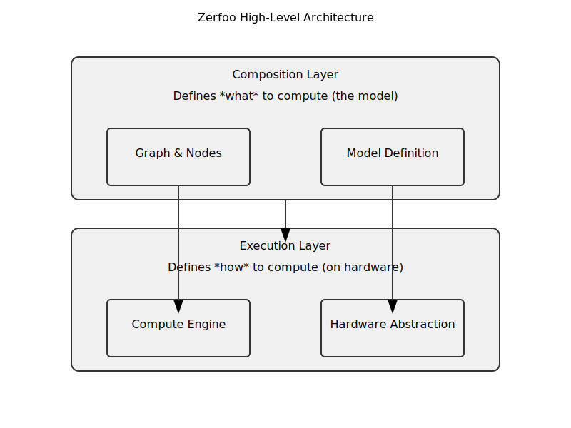
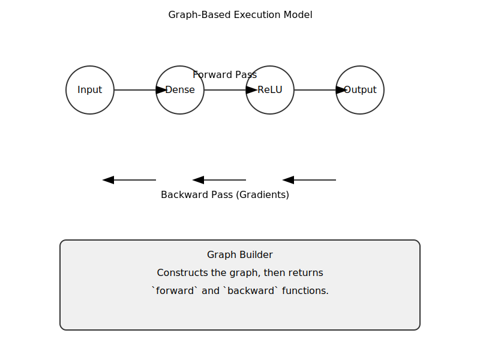
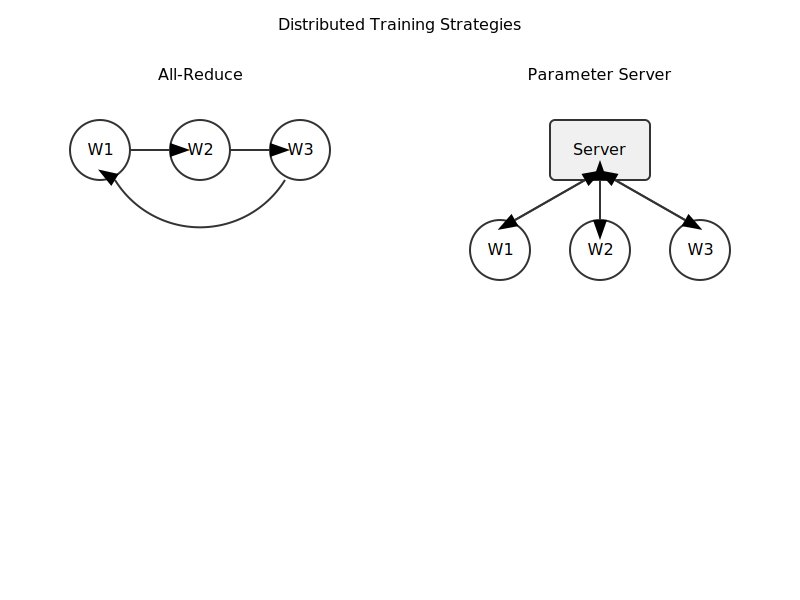

# Zerfoo ML Framework Architectural Design

## Quick Start

This section provides a brief, end-to-end example of how to define, train, and use a simple model in Zerfoo.

```go
package main

import (
	"fmt"

	"github.com/zerfoo/zerfoo/compute"
	"github.com/zerfoo/zerfoo/graph"
	"github.com/zerfoo/zerfoo/layers/activations"
	"github.com/zerfoo/zerfoo/layers/core"
	"github.com/zerfoo/zerfoo/tensor"
	"github.com/zerfoo/zerfoo/training"
)

func main() {
	// 1. Create a compute engine
	engine := compute.NewCPUEngine()

	// 2. Define the model architecture
	builder := graph.NewBuilder[float32](engine)
	input := builder.Input([]int{1, 10})
	dense1 := builder.AddNode(core.NewDense(10, 32), input)
	act1 := builder.AddNode(activations.NewReLU(), dense1)
	output := builder.AddNode(core.NewDense(32, 1), act1)

	// 3. Build the computational graph
	forward, backward, err := builder.Build(output)
	if err != nil {
		panic(err)
	}

	// 4. Create an optimizer
	optimizer := training.NewAdamOptimizer[float32](0.01)

	// 5. Generate some dummy data
	inputTensor, _ := tensor.NewTensor(engine, []int{1, 10})
	targetTensor, _ := tensor.NewTensor(engine, []int{1, 1})

	// 6. Run the training loop
	for i := 0; i < 100; i++ {
		// Forward pass
		predTensor := forward(map[graph.NodeHandle]*tensor.Tensor[float32]{input: inputTensor})

		// Compute loss (dummy loss for this example)
		loss := predTensor.Data()[0] - targetTensor.Data()[0]
		grad := tensor.NewScalar(engine, 2*loss)

		// Backward pass
		backward(grad, map[graph.NodeHandle]*tensor.Tensor[float32]{input: inputTensor})

		// Update weights
		optimizer.Step(builder.Parameters())
	}

	fmt.Println("Training complete!")
}
```

### Quick Start: Load and Run a ZMF Model

```go
package main

import (
    "context"
    "github.com/zerfoo/zerfoo/compute"
    "github.com/zerfoo/zerfoo/model"
)

func main() {
    // 1) Create engine
    eng := compute.NewCPUEngine()

    // 2) Load a pre-converted ZMF model
    //    ZONNX produces `.zmf`; Zerfoo runtime only consumes ZMF.
    m, err := model.LoadZMF(context.Background(), eng, "./model.zmf")
    if err != nil { panic(err) }

    // 3) Prepare inputs according to the model's declared graph inputs
    //    (omitted for brevity)

    // 4) Run inference
    out, err := m.Forward(context.Background(), nil /* inputs map */)
    if err != nil { panic(err) }
    _ = out
}
```

## Introduction

Zerfoo is a Go-based machine learning framework designed to enable experimentation towards Artificial General Intelligence (AGI) while remaining practical for immediate tasks such as time series forecasting, sentiment analysis, and classification. The architecture is optimized to scale to extremely large models (AGI-scale) in the future, yet the initial implementation (MVP) focuses on core functionality for common ML tasks. Zerfoo takes a disruptive approach by leveraging Go’s strengths – strong typing, concurrency, and simplicity – to build an idiomatic, highly modular ML framework. The design emphasizes a **declarative model definition**, a graph-based execution model, and robust support for distributed training, all while avoiding common pitfalls of existing frameworks (complex class hierarchies, monolithic designs, etc.). This document outlines the architecture in detail, including core components, interfaces, execution model, and strategies for extensibility and performance.

## Design Goals and Principles

Zerfoo’s architecture is guided by fundamental software design principles (SOLID) and lessons from existing ML frameworks. Key goals and guiding principles include:

*   **Single Responsibility & Modular Design:** Each package and component has a focused responsibility, making the codebase easier to understand and extend. For example, graph construction, low-level tensor operations, and training loops are separated into different packages.
*   **Open/Closed Extensibility:** New model layers, devices, or optimizers can be added **without modifying** the core infrastructure. All core abstractions are defined via interfaces, so external packages can extend functionality by implementing those interfaces.
*   **Idiomatic Go & Simplicity:** The design prefers Go idioms such as composition over inheritance, small interfaces, and explicit error handling. Complexity is avoided in favor of clear, simple constructs that feel natural to Go developers. There are no monolithic “god classes” or global session objects – instead, functionality is achieved by composing simple, interoperable pieces.
*   **Composition Over Inheritance:** Zerfoo uses Go’s struct embedding to compose behaviors, rather than deep class hierarchies. Types can **embed** other types to reuse their functionality (a “has-a” relationship) without implying an “is-a” inheritance relationship. For example, a Convolutional layer could embed a Linear layer and an Activation layer, gaining their methods and logic without tightly coupling to a base class. This reduces coupling and makes it easy to swap or modify components (e.g. change the activation function) without affecting other parts.
*   **No Separate Initialization Phase:** All nodes and layers are fully configured at construction time. There is **no need for a separate** `Initialize()` call to populate shapes or parameters. This means once a model component is created, it is immediately ready for use, which eliminates an entire class of usage errors and state management issues.
*   **Error-Free Forward/Backward Passes:** Once a computational graph is built, executing the forward and backward passes will not produce runtime errors under normal conditions. By the time the model is constructed (built), all shape compatibility and configuration issues are resolved. Forward and backward methods are expected to be deterministic and safe, simplifying training loops and error handling.
*   **Explicit Construction & Functional Options:** Instead of complex constructor inheritance, Zerfoo uses explicit factory functions augmented with functional options for configuration. This pattern has been systematically implemented across 84% of layer constructors (21 out of 25), providing both flexibility and backward compatibility. Examples include:
    *   `NewLinear(engine, inputSize, outputSize, WithLinearInitializer(initializer))`
    *   `NewFFN(engine, inputSize, hiddenSize, outputSize, WithFFNInitializer(initializer), WithFFNBias(false))`
    *   `NewLayerNormalization(engine, normalizedShape, WithLayerNormEpsilon(1e-6))`
    *   `NewRotaryPositionalEmbedding(engine, dim, WithRotaryBase(10000.0))`
    
    This keeps constructors flexible, avoids large parameter lists, and allows for easy customization without breaking existing code.
*   **Declarative Model Definition:** Users can declare model architecture in a high-level, declarative style (using Go structs with tags or external definitions) and let the framework handle the wiring. This improves clarity and allows for automated tooling (e.g. code generation, UI-based model design) without sacrificing type safety.
*   **Avoiding Common ML Framework Pitfalls:** Zerfoo intentionally sidesteps anti-patterns observed in other frameworks. It forgoes heavy object-oriented inheritance (no base class that every layer must inherit), avoids global session/graph contexts in favor of explicit graph objects, and does not hide errors or state behind magic. Each interface is small and purpose-specific (Interface Segregation Principle) to avoid bloated types. The result is a design where components can be tested and used in isolation, and the framework can evolve without breaking existing code.

By adhering to these principles, Zerfoo aims to provide a **flexible, maintainable, and scalable** foundation for machine learning in Go.

## Architecture Boundaries

- Zerfoo is a runtime that is ONNX-agnostic and consumes only ZMF (Zerfoo Model Format).
- ZONNX is a separate converter/tooling module that translates ONNX ↔ ZMF. It must not depend on `zerfoo` runtime internals.
- ZMF is the single interchange format between converter and runtime. The runtime loads ZMF and constructs graphs; no ONNX parsing occurs in `zerfoo/`.
- Strings and exotic ONNX types are normalized in ZONNX. Runtime STRING tensors exist only when a specific op requires them.

### CI Architecture Guards

- CI enforces that `zerfoo/` imports do not reference ONNX or ZONNX packages.
- Static checks/grep in workflows fail builds on forbidden imports.


## High-Level Architecture Overview

At its core, Zerfoo represents models as **directed acyclic graphs (DAGs)** of computational nodes. Each node performs a specific operation (e.g. a layer or functional transform) and can take one or more inputs and produce an output. A model’s computational graph is built using a **Graph Builder** and then executed by an **Engine** that dispatches operations to the appropriate hardware. This section outlines the two fundamental layers of the architecture and how they interact:



*   **Composition Layer (Graph & Nodes):** The upper layer of Zerfoo is the composition of model components. Here, users define how data flows through various **nodes** (layers, activations, etc.) arranged in a DAG. The graph abstraction is responsible for connecting node outputs to inputs of other nodes, managing the topological order of execution, and coordinating the forward and backward passes. The composition layer is hardware-agnostic – it defines *what* operations to perform and in what order, but not *how* to execute them on a specific device.
*   **Execution/Hardware Abstraction Layer:** The lower layer is the execution engine that actually performs tensor computations on specific hardware (CPU, GPU, etc.). Zerfoo defines a **Tensor Operations interface** (Engine) that encapsulates fundamental numeric operations (matrix multiply, element-wise ops, etc.). Multiple engine implementations can exist (e.g. a CPU engine using pure Go or BLAS, a GPU engine using CUDA). Each engine satisfies the same interface, allowing the *same model graph* to be executed on different hardware simply by plugging in a different engine. This clear separation means model definitions are portable across hardware – one can train on CPU and later switch to a GPU engine without changing the model code.

**Node-Based DAG:** Every computational element is a **Node** that implements a common interface. For a numeric type `T` (e.g. `float32` or `float64`), a node exposes methods to get its output shape, list its trainable parameters, and execute forward or backward computations. In Go pseudocode, the core Node interface is:

```go
type Node[T Numeric] interface {
    OutputShape() []int
    Parameters() []Parameter[T]
    Forward(ctx context.Context, inputs ...*tensor.Tensor[T]) (*tensor.Tensor[T], error)
    Backward(ctx context.Context, outputGradient *tensor.Tensor[T]) ([]*tensor.Tensor[T], error)
}
```

Each node can represent a layer (like Dense, Conv, LSTM), an activation, or even a simple function (like addition, concatenation). Nodes are connected into a graph via a **Builder**, which creates input placeholders and adds nodes by wiring their inputs from earlier nodes. The outcome is a built DAG representing the model’s computation. Once built, the graph yields two callable functions: a `forward` function (for inference/training forward pass) and a `backward` function (for computing gradients given an output gradient). This design allows the training loop to obtain a self-contained forward and backward that can be invoked with actual `Tensor` data, abstracting away the graph traversal details. The DAG supports complex topologies (multiple inputs, multiple outputs, branching and merging) enabling advanced architectures.

**Example Workflow:** To illustrate, a user would create a graph builder (specifying the numeric type and desired compute engine), register input nodes (with given shapes), and then successively add layer nodes connected to those inputs. After adding the final output node, the builder is finalized to produce the `forward` and `backward` executors. At runtime, the user calls `forward(inputMap)` to get model outputs, and during training, calls `backward(outputGrad, inputMap)` to get gradients for each input or parameter. An optimizer then uses those gradients to update parameters before the next iteration. This separation of concerns – graph construction vs. execution – makes it easy to define models declaratively and run them efficiently.

## Modular Package Structure

Zerfoo’s codebase is organized into clear-cut packages, each handling a distinct aspect of the framework. This modular structure ensures separation of concerns and makes the system extensible. The primary packages and their responsibilities are:

*   **`tensor`**: Defines the `Tensor` type and related utilities. A tensor encapsulates an N-dimensional array of numeric data (with type parameter `T` for element type) and provides methods to query shape, retrieve underlying data, and potentially perform in-place modifications. Basic tensor manipulation and shape logic resides here. The `Numeric` interface is defined to constrain tensor element types (e.g. floats).
*   **`compute`**: Contains the **Engine** interface and implementations for various hardware backends. The `Engine[T]` interface defines low-level tensor operations such as matrix multiplication, addition, multiplication, setting memory, copying memory, etc. For example, an engine might have methods `MatMul(a, b, out)` for matrix multiply and similar routines for other operations. Concrete engines (CPU, GPU, etc.) implement these methods, possibly calling highly optimized libraries (BLAS, CUDA) under the hood. This package may also handle memory management specifics for devices (e.g. pinned memory for GPU).
*   **`graph`**: Provides tools for building and manipulating the computation graph. It defines the core `Node[T]` interface (described above) and a `Builder[T]` for constructing DAGs of nodes. The Builder manages node handles (identifiers) and ensures that when the graph is built, all dependencies are resolved and ordered. The graph package also may include logic for topological sorting of nodes, detecting cycles (to enforce acyclic), and composing the forward and backward execution flows. Additionally, simple merge nodes (like concatenation or sum of multiple inputs) can be provided here as utilities.
*   **`layers`**: A collection of sub-packages for predefined layer implementations. For example, `layers/dense` for fully connected layers, `layers/conv` for convolutional layers, `layers/rnn` for recurrent layers, `layers/attention` for attention mechanisms, etc. Each layer in `layers/...` is implemented as a struct (possibly embedding other structs) that satisfies the `Node[T]` interface (i.e., implements `Forward`, `Backward`, etc.). These layer packages can depend on `tensor` and `compute` for their operations, and typically will use the engine interface to perform their math. By organizing each family of layers separately, new layers can be added without affecting core packages.
*   **`training`**: Houses components for the training process. This includes optimizers (`Optimizer[T]` interface with methods like `Step(params)` to update parameters), learning rate schedulers (`LRScheduler` for adjusting learning rate over epochs), regularizers (`Regularizer` to apply weight decay or other regularization post-update), and possibly a high-level `Trainer` that orchestrates the training loop. This package might also contain `DataLoader` abstractions for batch loading of datasets. The goal is to keep training-related logic (optimizing parameters, managing epochs and batches, callbacks for logging) separate from the graph and engine.
*   **`model`**: Defines the `Model` interface and utilities for saving and loading models in the **ZMF (Zerfoo Model Format)**. A `Model` could be an object that groups together a graph (or reference to the output node) and the set of parameters. The package also provides `ModelImporter` and `ModelExporter` interfaces to support interoperability with ZMF.
    
    - ZMF Loader Contract: `model.LoadZMF(ctx, engine, path)` parses the ZMF protobuf, validates shapes/attributes, builds the runtime graph using only ZMF data, and returns a runnable model. Errors are surfaced with user-friendly messages when ZMF is incomplete or invalid.
    - The loader is the sole entry point that constructs runtime graphs from serialized artifacts; no ONNX parsing or semantics exist here.
*   **`device`** (optional): Abstractions for hardware devices and memory management. This could define a `Device` interface representing a physical or logical device (CPU, specific GPU, etc.) with methods to query device properties or allocate/free memory. Higher-level code can use this to enumerate available devices or direct operations to a particular device. This package is optional and primarily relevant for advanced scenarios (explicit device placement, memory pool management). In many cases, the `compute` engines handle device details internally.
*   **`distributed`**: Provides tools for distributed training across multiple processes or nodes. It defines interfaces like `DistributedStrategy` which encapsulate the communication patterns needed for multi-machine training. Implementations may include strategies such as All-Reduce (peers exchanging gradients), Parameter Server (central parameter node), or Hierarchical-AllReduce. The strategy interface typically includes methods to initialize communication, perform gradient synchronization (`AllReduceGradients`), and coordinate barriers or synchronization points. By isolating distributed logic here, the rest of the framework can remain unchanged whether training is single-machine or multi-machine.

Each of these packages is designed to be **open for extension but closed for modification** – new functionality can plug in via interfaces or new sub-packages without altering the stable core. This structure also aligns with Go’s preference for small, interoperable libraries, making Zerfoo’s components usable independently if needed.

## Core Interfaces and Data Types

To ensure flexibility and consistency, Zerfoo defines clear interfaces for key concepts like tensors, nodes, and optimization algorithms. Below are the core interfaces and types, along with their expected behaviors:

*   **Numeric Types and Local Dependencies:** Zerfoo defines a type constraint `Numeric` to allow numeric generics. The core framework supports all four precision types: `float32`, `float64`, `float16`, and `float8`. For lower-precision floating-point types, which are critical for optimizing model size and inference speed, Zerfoo integrates with local implementations. Specifically, it uses `github.com/dndungu/float16` for IEEE 754 compliant 16-bit `float16` support and `github.com/dndungu/float8` for E4M3FN format 8-bit `float8` support, both included as local package dependencies with replace directives in `go.mod`. This approach provides production-quality implementations while maintaining full control over the numeric foundation. The `numeric` package provides a unified API across all precision types with consistent arithmetic operations (Add, Mul, Sub, Div, Neg, Abs) and proper IEEE 754 compliance. All computations are parameterized by a generic type `T` which must satisfy the `tensor.Numeric` constraint, ensuring type safety across all supported precisions.

### Supported Data Types (Runtime)

- Floats: FP32, FP16, FP8
- Integers (quantized): INT8, UINT8
- Boolean: BOOL
- Strings: minimal/only when strictly required by an op

Exotic ONNX types are normalized in ZONNX to supported ZMF forms; runtime remains numeric-first.

### Quantization Execution Policy

- ZONNX preserves quantization info in ZMF: `Tensor.DataType` may be `INT8` or `UINT8`, and optional `Tensor.quant` carries `scale`, `zero_point`, `axis`, `symmetric`.
- Zerfoo executes quantized kernels (INT8/UINT8) where available (e.g., MatMul/GEMM/Conv; Gather if needed) and respects per-tensor vs per-channel quantization (`axis`).
- Fallback: if an op lacks a quantized kernel, dequantize at load/build to FP tensors for that op’s path only.

*   **Tensor:** The `tensor.Tensor[T]` type represents an n-dimensional array of values of type T. It provides methods like `Shape() []int` to get the dimensions, and `Data() []T` to access the raw data. Internally, a Tensor may also carry metadata like strides or device placement info, but those are abstracted behind the interface. Tensors are typically created by engine implementations or by high-level ops; users mostly interact with them through Node operations or simple creation utilities. For performance, the Tensor may either be a struct or an interface with optimized implementations for different backends (e.g., a struct for CPU tensor vs a separate struct for GPU tensor, both satisfying `Tensor[T]`)

*   **Engine (Compute Context):** The `compute.Engine[T]` interface defines low-level tensor operations that the execution engine must provide. All methods on the `Engine` interface must accept a `context.Context` as their first argument. This is a standard Go idiom for production systems that enables cancellation, timeouts, and deadline propagation. To optimize for high-performance and low-memory scenarios, `Engine` methods should accept an optional destination `dst` tensor (e.g., `Add(ctx, a, b, dst)`). If `dst` is provided, the result should be written into it directly, avoiding a new memory allocation. Representative methods include:

    *   `MatMul(ctx context.Context, a, b, dst *Tensor[T]) error` – perform matrix multiplication of tensor `a` and `b`, storing result in `dst`.
    *   `Add(ctx context.Context, a, b, dst *Tensor[T]) error` – element-wise addition of `a` and `b`.
    *   `Mul(ctx context.Context, a, b, dst *Tensor[T]) error` – element-wise multiplication.
    *   Other tensor ops like convolution, activation functions (ReLU, Sigmoid) might be included or built from basic primitives.
    *   Memory operations: `Zero(ctx context.Context, t *Tensor[T])` to set a tensor’s data to zero, `Copy(ctx context.Context, dst, src *Tensor[T])` to copy data.

    The Engine interface is the **hardware abstraction layer**. For example, a CPU engine could implement `MatMul` by calling optimized BLAS routines (via Gonum or another library), whereas a GPU engine might call cuBLAS or cuDNN via Cgo. The framework will provide a default CPU engine that uses pure Go or Go-backed libraries for easy use, and optional engines for GPU/TPU that leverage external libraries. By coding to the Engine interface, the higher-level graph execution can remain device-agnostic. Users select an engine (e.g., `cpuEngine := compute.NewCPUEngine()`) and pass it to the graph builder; thereafter all node computations go through this engine.

*   **Node and Parameter:** As mentioned, each computational node implements the generic `Node[T]` interface with methods for output shape, parameters, forward and backward computation. The `Parameters() []Parameter[T]` method returns a slice of Parameter objects that the node contains. A **Parameter** encapsulates a trainable weight or bias (essentially wrapping a `Tensor[T]` for the weight and another for the gradient). Zerfoo defines `Parameter[T]` with methods to get the current weights and to access the gradient accumulator. Typically, a layer struct will hold its parameters (e.g., a Dense layer holds a weight matrix and bias vector, each likely implemented as a `Parameter[T]`). The Parameter interface allows optimizers to generically access and update weights.

*   **Builder and NodeHandle:** The graph `Builder[T]` interface is used to incrementally construct a DAG. It provides methods like `Input(shape []int) NodeHandle` to register external input nodes, and `AddNode(n Node[T], inputs ...NodeHandle) (NodeHandle, error)` to add a new node to the graph, returning a handle to reference it later. The `NodeHandle` is an opaque identifier (or small struct) that represents a node in the builder context. Once all nodes are added, `Build(output NodeHandle)` finalizes the graph, performing checks (like shape consistency) and returns the executable functions: `forward` and `backward` closures (and possibly an error if the graph is invalid). After building, the builder is typically not needed; the returned forward/backward functions capture the graph structure.

*   **Optimizer:** The training process uses optimizers to update parameters based on gradients. Zerfoo’s `training.Optimizer[T]` interface might include methods `Step(params []Parameter[T]) error` to apply an update to a list of parameters. It may also allow setting or getting hyperparameters like learning rate (`SetLearningRate`/`GetLearningRate`). Implementations could include SGD, Adam, etc., maintaining any required state (e.g., momentum, moment estimates) internally. The `Step` method would typically iterate through the provided parameters, read each `Parameter`’s current gradient (via `param.Gradients()` which yields a Tensor), and adjust the weights accordingly.

*   **Regularizer and Scheduler:** To support training customization, Zerfoo includes interfaces for regularization and learning rate scheduling. A `Regularizer[T]` can implement an `Apply(params []Parameter[T]) error` to enforce penalties (like L2 weight decay) on parameters. An `LRScheduler` interface might have methods like `OnEpochEnd(epoch int)` or `OnBatchEnd(batch int)` to adjust the optimizer’s learning rate over time. These allow injecting common training tricks in a pluggable way.

*   **DistributedStrategy:** For multi-node training, Zerfoo defines a `DistributedStrategy` interface to abstract different distributed training schemes. Methods typically include `Init() error` to set up networking or shared state, `AllReduceGradients() error` to perform synchronization of gradients across nodes, and `Barrier() error` to coordinate synchronization points. In practice, a specific implementation might use Go’s RPC or gRPC to communicate between nodes and perform collective operations (like summing gradients from all workers). The training loop, if operating under a DistributedStrategy, would call `AllReduceGradients()` after each backward pass to ensure each node has the averaged gradients before updating parameters. By changing out the strategy, the user could switch between different distributed algorithms (parameter server vs. all-reduce, etc.) without altering the model or optimizer code.

These interfaces establish **contracts** between different parts of the framework. By coding to interfaces, Zerfoo ensures that components like layers or optimizers can work with any compliant Engine or Tensor implementation. It also enables advanced use cases – for example, a research user could implement a new kind of `Engine` (say, an engine that dispatches ops to multiple GPUs) and as long as it satisfies the interface, all existing graphs and nodes can utilize it.

## Error Handling Philosophy

Zerfoo adopts a clear and consistent error handling strategy to improve robustness and developer experience.

*   **Low-Level Operations Return Errors:** Low-level operations, particularly those in the `compute.Engine` and `tensor` packages, should always return an `error` value. This includes operations that might fail due to invalid input, hardware issues, or other runtime problems. This allows the calling code to handle these errors gracefully.
*   **Higher-Level Components Panic on Programmer Error:** Higher-level components, such as `core` and the `graph.Builder`, should `panic` on unrecoverable errors that indicate a programming mistake. For example, a shape mismatch during a forward pass, which should have been caught during the graph build phase, is considered a programmer error. This "panic on programmer error" approach simplifies the training loop, as `forward` and `backward` calls don't need to be cluttered with `if err != nil` checks for conditions that should not occur in a correctly constructed graph.

This strategy ensures that recoverable errors are handled explicitly, while unrecoverable programmer errors are surfaced immediately, making the framework both robust and easy to debug.

## Graph Construction and Execution Model

Zerfoo employs a **static graph construction** phase followed by an execution phase. This design is reminiscent of frameworks like TensorFlow’s static graphs but made ergonomic in Go and without the overhead of a global session. Here’s how it works in detail:



**Graph Building:** Users start by creating a `Builder[T]` from the `graph` package, often providing the Engine or context to use. For example, `builder := graph.NewBuilder[float32](engine)`. Through the builder, the user declares the graph’s inputs and nodes: calling `builder.Input(shape)` reserves a placeholder for external data of a given shape, and returns a `NodeHandle` that represents that input in the graph. Then the user adds nodes using `AddNode`. For instance, one might do:

```go
x := builder.Input([]int{10})                          // input vector of length 10  
dense1 := builder.AddNode(layers.NewDense(10, 32), x)  // dense layer from 10->32  
act1 := builder.AddNode(layers.NewReLU(), dense1)      // ReLU activation on dense1  
```

Each `AddNode` call takes a Node (like a layer instance) and the handles of its input nodes. Internally, the builder will ensure the provided inputs match the node’s expected number of inputs and possibly check shape compatibility. It returns a new handle for the added node (or an error if, for example, shapes are incompatible or types mismatch). The builder accumulates all nodes and their connections.

**Finalizing the Graph:** Once the model’s last output node is added, the user calls `forward, backward, err := builder.Build(outputHandle)`. The builder then performs final validation and setup: it may do a topological sort of nodes to determine execution order, ensure every required input is connected, and allocate any needed internal buffers. If successful, it produces two closures: `forward(inputs map[NodeHandle]Tensor[T]) Tensor[T]` and `backward(dOut Tensor[T], inputs map[NodeHandle]Tensor[T]) map[NodeHandle]Tensor[T]`. The `forward` function, when called with actual input tensors (matched to the input handles), will execute each node’s Forward method in the correct order and return the final output tensor. The `backward` function, given a gradient on the output (dOut) and the same inputs, will run the Backward pass through the graph and return gradients for each input node (and, by side effect, compute and store gradients for all parameters in each node). Notably, after `Build()`, the graph is fixed – you cannot add more nodes; if a different architecture is needed, you create a new builder.

**Execution (Forward Pass):** During forward execution, the engine is used under the hood by each node’s Forward method. For example, a Dense layer’s Forward will take the input tensor, perform a matrix multiply with its weight tensor via the Engine’s `MatMul`, add a bias (Engine’s `Add`), and return the result as a new tensor. Activation nodes will apply element-wise functions (which might call Engine’s methods or implement in pure Go if simple enough). The forward pass may also store some intermediate results on the node for use in backward (for instance, a ReLU node might remember which entries were zeroed out to simplify computing its gradient). The use of Go’s efficient concurrency is encouraged within nodes or the Engine; for instance, an Engine could parallelize a large matrix multiplication across CPU cores, or nodes could spawn goroutines for independent sub-computations. The framework does not dictate a specific parallelism strategy but allows it wherever safe to do so (ensuring deterministic results if needed). Concurrency control primitives (goroutines, channels, sync.WaitGroup, etc.) from the Go standard library will be utilized for performance without introducing data races.

**Execution (Backward Pass & Automatic Differentiation):** Zerfoo uses reverse-mode automatic differentiation (backpropagation) to compute gradients efficiently for all parameters. When `backward` is invoked with an output gradient (often the derivative of loss w\.r.t. the output, like dLoss/dOut), the framework traverses the graph in reverse topological order. Each node’s `Backward` method is called with the gradient flowing from its output, and it returns the gradient with respect to its inputs. For example, the Dense layer’s Backward will take dOut (which is dLoss/dOutput for that layer), use the Engine to compute gradients: multiply dOut by the weight matrix to get gradient wrt input, and multiply the transpose of input by dOut to get gradient wrt weights (and sum dOut to get gradient wrt bias). The Dense node will then store its weight and bias gradients internally (often inside the `Parameter` objects), and return the input gradient which will propagate to whatever was feeding into Dense. In this manner, gradients flow backward all the way to the input placeholders (or earlier layers). The automatic differentiation engine relies on each primitive operation (node) knowing how to compute its own gradients; this is implemented in the `Backward` methods. The framework ensures intermediate values needed for gradient computation (like the input to an activation, or the output of a matmul before activation) are available – nodes might cache those from forward or recompute if necessary. By recording the computational graph structure and associating each operation with its gradient calculation, Zerfoo’s backpropagation can compute the gradient of the final loss with respect to every parameter efficiently in one backward sweep. This design draws from Gorgonia’s approach of recording a graph of computations and their gradients for automatic differentiation.

**Parameter Gradient Tracking:** As part of the graph execution, **parameter management** is integrated with autograd. Each trainable parameter in a node is typically represented as a `Parameter[T]` containing both the value (weights) and a gradient tensor. Zerfoo adopts a system akin to *dual values* (in Gorgonia), where each parameter tensor has a paired gradient tensor associated at creation. This means as soon as a weight is created in a layer, a gradient accumulator of the same shape is also created and linked. During the backward pass, when the layer computes gradients, it directly populates this accumulator. The graph keeps references so that given a parameter node one can quickly retrieve its gradient counterpart. This design ensures no gradient is lost or mismatched – the mapping from each weight to its gradient is fixed and known. It also allows optimizers to simply collect all parameters from the model (e.g., by traversing nodes or via the builder) and get their gradients without extra bookkeeping. All parameter and gradient tensors reside on the device managed by the Engine (e.g., GPU memory for GPU engine), ensuring that gradient computations and updates occur on the same device where the forward pass happened.

**No Runtime Errors:** Thanks to the static build phase and interface contracts, once the `Build()` succeeds, using the `forward` and `backward` should not encounter shape mismatches or missing data errors. If a user inadvertently provides an input tensor of the wrong shape or type at runtime, the framework will ideally catch that (for example, by checking the provided tensor’s shape against the expected shape stored in the input NodeHandle). But aside from user input errors, the graph execution is robust. This is a deliberate design choice to make training loops easier to manage; you don’t need to wrap every forward/backward in extensive error handling because the hard checks are done upfront. If something was going to go wrong (like an incompatible layer configuration), it would surface during `Build()` as an error, not during model training.

In summary, the graph construction and execution model of Zerfoo provides a **declarative yet efficient** approach: you describe your model architecture once, get a compiled computation graph, and then execute it as needed. It marries some advantages of static graphs (optimization opportunities, clear separation of model definition from execution) with a user-friendly interface in Go (no need for a separate DSL or session context beyond the builder object).

## Automatic Differentiation and Parameter Management

Automatic differentiation (AD) and parameter management are critical for training complex models, especially for AGI-scale networks. Zerfoo tightly integrates these concerns into the framework core rather than bolting them on later. Here’s how AD and parameter handling are designed:

*   **Reverse-Mode AD:** Zerfoo implements reverse-mode AD (a.k.a. backpropagation) given its efficiency for models with many parameters. During the forward pass, the framework conceptually records a *tape* or graph of operations, though in our static graph design this structure is already known at build time. Each node operation has a corresponding derivative computation. When initiating `backward`, Zerfoo effectively traverses the graph from outputs to inputs, calling each node’s derivative in sequence. This yields gradients for all inputs and ultimately all trainable parameters. Because the number of parameters in modern models is huge compared to outputs, reverse-mode is the only feasible way to get all gradients in one pass. Zerfoo’s approach ensures that gradient calculation is accurate and efficient, matching mathematically with the forward computations.

*   **Gradient Calculation and Storage:** Each operation in Zerfoo knows how to compute its gradient. For example, a matrix multiply node knows that if $Z = X \times W$ (say $X$ is input, $W$ is weight, $Z$ is output), then the gradient $dX = dZ \times W^T$ and $dW = X^T \times dZ$. Such formulas are implemented in the `Backward` method of the corresponding Node. The Engine is often used to perform these computations (transposing, multiplying, etc., on tensors). Intermediate values from forward (like $X$ or $W$ in the above example) might be cached in the node to avoid recomputation in backward. Zerfoo’s static graph means we know exactly which values need caching. The framework might automatically save needed activations or upstream outputs when running forward if their corresponding backward uses them – similar to how frameworks like TensorFlow store activations for backprop.

*   **Parameter Store:** All model parameters are registered in a central structure or accessible collection, sometimes called a **parameter store**. This could simply be the set of all `Parameter[T]` objects gathered from each node in the built graph. The parameter store concept is important for optimizers and serialization – it provides a single point to iterate over all weights and their gradients. As described earlier, Zerfoo uses a linked parameter-and-gradient approach (dual value) so that each parameter knows its gradient. The parameter store ensures that at training time, optimizers can retrieve up-to-date gradients for every parameter easily. It also helps in zeroing out gradients each iteration if needed, or moving all parameters to a specific device collectively.

*   **Optimizers and Updates:** An optimizer (SGD, Adam, etc.) will typically take the list of parameters from the parameter store after each backward pass and update their values. Because the gradients are already computed and stored in each Parameter, the `Optimizer.Step()` can loop through parameters and for each do: `w = w - lr * grad` (for simple SGD) or more complex math for Adam. Any optimizer-specific state (e.g., Adam’s momentum and velocity terms) would be maintained inside the optimizer instance keyed by parameter (perhaps via a map from Parameter to state, or by embedding state in Parameter – the design can vary, but likely the optimizer holds its own state). The crucial point is that Zerfoo’s core ensures gradients are ready and aligned with parameters when `Step` is called.

*   **Consistency and Synchronization:** In a multithreaded or distributed context, consistent parameter updates are vital. Zerfoo’s design, by default, performs backward passes sequentially in the main training thread (though internal ops can be parallelized). After backward, the parameters’ gradients are essentially static until the optimizer updates them. If using multiple goroutines to compute gradients for different parts of the network (possible if subgraphs are independent), Zerfoo would use synchronization (e.g., WaitGroups or barriers) to ensure all gradient contributions are done before update. In distributed training, Zerfoo relies on its `DistributedStrategy` to synchronize gradients between nodes (see next section), after which the optimizer on each node will perform identical updates for consistency.

*   **Memory Management for Gradients:** Since large models can be memory-intensive, Zerfoo carefully manages allocation of gradient tensors. The initial creation of a Parameter might allocate a gradient tensor of the same shape as the weight (possibly on the selected device memory). Over training iterations, these gradient tensors can be reused – they are zeroed and filled every backward pass, rather than allocated anew. The Engine interface provides a `Zero(tensor)` method which can efficiently reset tensor values to zero. This helps avoid garbage collection overhead for short-lived gradient arrays. Additionally, if needed, Zerfoo could implement gradient accumulation over batches (e.g., if using micro-batches to split a large batch across devices, summing gradients from each micro-batch before an optimizer step). The parameter management infrastructure would support this by not immediately updating weights until commanded, and possibly accumulating gradients in the Parameter’s gradient tensor across calls.

In essence, Zerfoo’s automatic differentiation and parameter management are built to handle the **scale and complexity** of modern deep learning while abstracting the details away from the user. The user simply defines the model and the loss; Zerfoo handles computing all the right gradients and exposing them for optimization. By integrating parameter tracking with graph construction (each node declares its parameters), we ensure that nothing is forgotten and that the system can manage thousands or millions of parameters systematically. This unified approach is critical for correctness and efficiency in large-scale training.

## Layer Composition and Reusability

A major aim of Zerfoo is to maximize code reuse and flexibility in defining model components. To achieve this, the framework encourages building layers through composition of simpler elements and idiomatic Go features, rather than monolithic classes or deep inheritance.

**Struct Embedding for Layers:** In Go, struct embedding provides a simple mechanism to compose behavior. Zerfoo leverages this heavily in layer implementations. For example, consider a hypothetical `Conv2D` layer that might internally want a fully connected component and an activation: it could embed a `layers.Dense` (for the fully connected logic) and an `layers.Activation` (for the non-linearity). By embedding, `Conv2D` automatically gets the methods of `Dense` and `Activation` if needed, but more importantly, it can call into their functionality to perform parts of its job. This means the `Conv2D` doesn’t have to reimplement weight storage or an activation’s forward pass – it can reuse them. Embedding is used only when it semantically makes sense (“has-a” relationship), maintaining clarity. This approach results in layers that are essentially *assemblies of primitive operations*. It avoids the rigidity of class inheritance (where a subclass might inherit a lot of irrelevant or unneeded behavior from a base class). Instead, any layer can utilize any other via composition, which fosters experimentation (swap components in and out easily) and reduces code duplication. All layers ultimately implement the Node interface, but they do so by composing simpler nodes internally.

**Interfaces for Common Behaviors:** Where appropriate, Zerfoo defines small interfaces to represent common capabilities, which layers can satisfy. For instance, one could imagine an `Initializer` interface if certain layers allow custom weight initialization, or a `Trainable` interface (though `Node.Parameters()` already indicates trainable parameters). Because Go interfaces are satisfied implicitly, a layer just needs to implement the method to fulfill the contract. This provides flexibility akin to mixins – e.g., any layer that has parameters can implement an interface to reset or initialize those parameters in a custom way. The key is these interfaces remain **focused** (one or two methods) to avoid bloating layer definitions (Interface Segregation Principle).

**Reusing Functional Building Blocks:** In Zerfoo, we strive to implement each mathematical operation or transform in one place and reuse it everywhere. The Engine interface already encourages reuse of basic tensor ops across all layers. Similarly, layers themselves can share building blocks. For example, a Dropout layer (which randomizes some inputs to zero during training) can be a thin node that uses tensor operations and random number generation without needing special-case integration elsewhere. If two different layer types both need a certain transform, we prefer to implement that as either a utility function or its own small Node that can be composed. This way, the library of nodes becomes like Lego pieces – model architects can snap them together in novel ways. Composability is also achieved via the DAG itself: because any node can feed into any other, users can construct composite behaviors at the graph level (like adding the outputs of two sub-networks, or feeding one network’s output into two different layers). The framework ensures these compositions work as long as shapes line up.

**Separation of Concerns and Component-Based Architecture:** Each layer focuses on a single conceptual operation. Complex layers are built by composing simpler, reusable components rather than implementing monolithic units. Zerfoo implements a comprehensive component-based architecture in the `layers/components/` package that provides building blocks for layer construction:

*   **WeightInitializer Components:** Pluggable initialization strategies including `XavierInitializer` (Glorot uniform), `HeInitializer` (He normal), and `UniformInitializer` for flexible weight initialization.
*   **MatrixMultiplier Component:** Handles matrix multiplication operations with methods like `Multiply()`, `MultiplyWithDestination()`, and `Transpose()` for efficient linear algebra.
*   **LinearGradientComputer Component:** Manages gradient computations with `ComputeWeightGradient()`, `ComputeInputGradient()`, and `ComputeBothGradients()` for automatic differentiation.
*   **Composed Layer Example:** The `LinearV2` layer demonstrates component composition, using dependency injection via `LinearConfig` to combine different initialization strategies and computation methods.

This granular approach provides several advantages:

*   **Reusability:** Components can be shared across different layer types (e.g., the same initializer used in Linear, Dense, and Attention layers).
*   **Testability:** Each component has focused unit tests with 100% coverage, making the system more reliable.
*   **Flexibility:** Easy to swap initialization strategies or computation methods without modifying layer code.
*   **Maintainability:** Clear separation of concerns with single-responsibility components.

If a user wants an activation function after the dense layer, they add an `Activation` node to the graph explicitly. Zerfoo does not bundle activations inside layers like `Dense`. While a convenience wrapper like `DenseWithActivation` could be provided, under the hood it would still be a composition of the distinct `Dense` and `Activation` nodes. The **forward** and **backward** logic of layers are implemented with the help of Engine operations or other Node’s methods, not with ad-hoc loops or hardcoded algorithms wherever possible. This uniformity means that improvements in one area (say a faster Engine implementation for matrix ops) benefit all layers automatically.

**Avoiding Anti-Patterns in Layer Design:** We explicitly avoid patterns like:

*   *Large Base Layer Classes:* In some frameworks, every layer inherits from a common base that does too much (handles weights, device logic, forward, backward, etc. for all). Zerfoo does not have a monolithic base class; common functionality is achieved through shared helper functions or embedding as needed, keeping each layer class minimal.
*   *Hidden Side Effects:* Layers do not perform unexpected work during construction or forward passes. For example, no layer will secretly initialize a global state or alter other layers. All interactions are via the graph and parameter store explicitly.
*   *Excessive Reflection in Core Path:* While Zerfoo uses reflection for certain features (like struct-tag based model definition, discussed below), the hot path of forward/backward doesn’t rely on reflection. It’s all pre-wired and static. This avoids runtime overhead and unpredictable failures.

By carefully designing layers to be **small, interchangeable components**, Zerfoo makes it feasible to build very complex models (like those needed for AGI research) out of tested, reliable pieces. This approach also aids debugging – if a certain layer is causing an issue, it’s localized to that component’s code, not hidden in a giant class hierarchy.

## Declarative Model Specification (Struct Tags & Code Generation)

To maximize ease of use, Zerfoo supports a declarative style for defining models. Instead of imperatively constructing graphs in code for every model (which can be verbose), users have the option to define models as Go structs with special tags, or even use external specifications (YAML/JSON or a visual UI) that can be translated into Go code. This approach accelerates prototyping while preserving the benefits of a compiled language.

**Go Struct Tags for Model Definition:** A user can define a Go struct where each field represents a layer or sub-model, and use struct tags to specify its parameters and connections. This approach removes ambiguity and allows for complex, non-sequential architectures to be defined declaratively. For example:

```go
type MyModel struct {
    Input  *layers.Input `zerfoo:"shape:[1, 128]"`
    Layer1 *layers.Dense `zerfoo:"input:Input, output_size:64"`
    Act1   *layers.ReLU  `zerfoo:"input:Layer1"`
    Layer2 *layers.Dense `zerfoo:"input:Act1, output_size:10"`
}
```

In this example, the `input` tag explicitly names the source field in the struct, creating an unambiguous DAG. The framework's `graph.BuildModel(&myModelStruct)` function would parse these tags, instantiate the corresponding layer nodes, and wire them together based on the explicit dependencies. This makes the model definition robust and self-documenting. It’s akin to how ORMs use struct tags to map fields to database columns, but here mapping layers to a neural network graph.

**Advantages of Struct-Based Definition:** This style ensures the model architecture is described in one place (the struct) in a readable format. It also opens up possibilities for tooling: for instance, a CLI tool could read a YAML specifying a model architecture and auto-generate the Go struct definition with appropriate tags, which the user can then refine. Or the user could design a model in a web UI (drag-and-drop layers, set their sizes) and the tool outputs a Go source file with the struct and tags representing that model. Because Go’s reflection can enumerate struct fields and tags, Zerfoo can build the graph at runtime from this specification. The use of tags keeps the approach flexible (new properties can be added in tags as needed) and non-intrusive (if a user doesn’t want to use this system, they can ignore it and build graphs manually as shown earlier). 

**YAML/JSON to Go Code Generation:** In addition to (or instead of) runtime reflection on struct tags, Zerfoo could provide a code generation pathway. The idea would be: users describe the model in a config file (YAML/JSON) – for example, list of layers with parameters and how they connect – and a tool reads this and produces a Go file with the corresponding struct and initialization code. This way, users get a starting point in Go that they can compile and run, blending the convenience of a high-level spec with the performance and safety of Go. This approach mirrors how one might use a UI designer to generate code in UI frameworks. By generating actual Go code, we ensure that at runtime there’s no performance penalty (everything is compiled in), and it’s easier to debug or modify by hand. The generation could leverage Go’s `text/template` package to fill in templates for layer definitions.

**Web UI for Model Design:** A further optional component envisioned is a web-based UI where users can graphically create a model (e.g., add a layer, connect it to another, set properties via forms). Since Zerfoo is a Go framework, it can easily serve a web application (using the standard `net/http` package) for this purpose. Such a UI would allow interactive model construction without writing code, ideal for quick experiments or for those less familiar with the code. Once a design is complete, the UI could either directly invoke Zerfoo’s builder to instantiate the model or export the model to a struct/YAML which the user can then use. The key difference from dynamic graph frameworks is that here the output is still a compile-time structure (if converted to code). This hybrid approach – designing in a UI, then executing as compiled code – offers both ease of use and performance. It avoids the pitfalls of purely runtime-defined graphs (which can be harder to debug and less performant) by ultimately generating Go code or a static graph definition that is then executed. In effect, Zerfoo can treat the UI or declarative spec as just another way to specify the graph, feeding into the same Builder mechanism under the hood.

**Maintaining Idioms:** While these high-level tools exist, they are built on top of Zerfoo’s core APIs, not replacing them. Advanced users can always directly use the builder and layer constructors in code for full control. The declarative options are entirely optional but are provided to speed up development and lower the barrier to entry. Additionally, because the struct tag approach leverages Go’s type system (the fields are actual typed layer objects) and the code generation approach produces real Go code, the resulting models are fully type-safe and checkable by the Go compiler. This is an important distinction from frameworks that use runtime construction (like assembling layers in Python at runtime); Zerfoo’s generated models can be caught by the compiler if, say, a layer’s output type doesn’t match the next layer’s input type, etc. We get the best of both worlds: interactivity and declarativity, plus compiled reliability.

## Training Loop and Usage Example

Using Zerfoo to train a model involves a few clear steps which leverage the components described above. Here we outline a typical training workflow to demonstrate how everything comes together, from model definition to updating weights:

1.  **Define Model Architecture:** The user defines the model either by using the declarative struct method or by manually building via `Builder`. For instance, assume we have a struct-based model `MyModel` or we manually do builder calls; either way we now have an output node handle (or a Model object that encapsulates it). If using a struct, we might call `builder, inputs := graph.BuildModel(&myModel)` which returns a builder and input handles ready to use. The model architecture might include, for a time-series example, an RNN layer followed by a Dense for output; for sentiment analysis, perhaps an embedding layer, followed by a sequence aggregator and a classifier. Zerfoo’s layer library would provide these common components.

2.  **Initialize Builder and Engine:** The user chooses an execution engine. For initial use, this could be the default CPU engine: `engine := compute.NewCPUEngine()` (which perhaps internally uses multi-threaded BLAS). For acceleration, if GPU is available, `engine := compute.NewCUDAEngine()` could be used. The engine is passed into the graph builder so that all operations will utilize it. For distributed training, at this time the user might also initialize a distributed strategy (e.g., `dist := distributed.NewAllReduceStrategy(...); dist.Init()`)

3.  **Build Computational Graph:** The model is built into a graph if not already done. If using the manual approach:

    *   `builder := graph.NewBuilder(engine)`
    *   Define inputs: e.g., `input := builder.Input([]int{sequenceLength, features})`
    *   Add nodes: e.g., `rnnOut := builder.AddNode(layers.NewLSTM(...), input)`, then `denseOut := builder.AddNode(layers.NewDense(...), rnnOut)`
    *   The final output handle is `denseOut` (for example).
    *   Call `forward, backward, err := builder.Build(denseOut)`.

    Now we have the `forward` and `backward` functions ready. If using struct tags, the `BuildModel` might internally do all this and yield similar closures or a `Model` object containing them.

4.  **Prepare Training Components:** Create an optimizer, e.g., `opt := training.NewAdamOptimizer(learningRate)`; optionally a learning rate scheduler or any regularizers. If distributed, ensure all processes have the same initial weights (Zerfoo could handle broadcasting initial parameters via the `DistributedStrategy` on startup). Also prepare the dataset, perhaps via a DataLoader that provides batches of input tensors and target outputs.

5.  **Training Loop Execution:** For each epoch, and for each batch in the dataset:

    *   Call `yPred := forward(inputMap)` – where `inputMap` maps the input NodeHandles to actual Tensor data for this batch. The result `yPred` is a Tensor of model outputs (predictions).
    *   Compute the loss. Zerfoo might not dictate a specific loss function interface; the user can compute loss by applying operations in the graph or outside. For example, one could have included a loss node in the graph. Alternatively, the user can simply compute loss in Go (e.g., mean squared error by comparing `yPred` and truth). If the loss is computed outside, we then get a gradient of loss w\.r.t. the model output. If the loss is part of the graph, then the `yPred` from forward might effectively *be* the loss scalar. In that case, backward would be called with a gradient of 1 for that loss output.
    *   Call `grads := backward(dLoss, inputMap)` – providing the gradient of loss w\.rt the output. If the output is a scalar loss, `dLoss` might be just 1.0. If output is a vector (e.g., for multi-class classification, outputs are logits), then we supply the gradient of the loss for each output (which the user can compute via known formulas or a small helper function). After this call, all Parameter gradients are populated (and `grads` map contains gradients for inputs if needed for analysis).
    *   Optimizer step: `opt.Step(params)`, where `params` is the list of model parameters. The optimizer will use each Parameter’s current gradient (populated by backward) and update the Parameter’s weight (for example, weight = weight - lr * grad for SGD). Zerfoo’s design ensures the Parameter list can be obtained easily, perhaps via a method like `builder.Parameters()` or by having kept track of them. After Step, weights are updated in place.
    *   If using a learning rate scheduler, call `scheduler.OnBatchEnd()` to adjust learning rate if needed. If using distributed training, also call `dist.AllReduceGradients()` **before** the optimizer step if doing synchronous training, so that each node applies global average gradients (in practice, for efficiency, AllReduce might be done *instead of* computing on one node – e.g., each backward could be computing partial gradients and then they are summed across nodes – but from the user perspective it’s one extra call to sync).

    During this loop, Zerfoo’s framework ensures thread safety where needed. For example, if using multiple goroutines to fetch data while training, the user might protect calls or use context cancellation to stop training gracefully. Zerfoo encourages leveraging Go’s concurrency for things like overlapping data loading and computation.

6.  **Epoch End and Evaluation:** After each epoch, the user can evaluate model performance on a validation set. This simply involves using the `forward` function on validation data (without calling backward or optimizer). Because forward is a pure function of inputs (no internal state change except maybe caching), it can be called concurrently on multiple batches if desired (e.g., using goroutines to evaluate in parallel) or sequentially. The framework does not distinguish training vs inference mode explicitly, except that certain layers like Dropout might need to behave differently. Those layers can have an internal flag for "training mode" vs "inference mode" that the user toggles, or more simply, one could instantiate a slightly different graph for inference (omitting dropout or using moving average batchnorm parameters, etc.).

7.  **Model Checkpointing:** Periodically, the user can save the model. Using the `model.ModelExporter` interface, one could do something like `modelExporter.ExportModel(myModel, "path/to/file.zmf")`. This will save the model in the ZMF format.

This workflow demonstrates Zerfoo’s end-to-end usage. It highlights the declarative building of a model, the execution of graph forward/backward passes, and the integration with training utilities and possibly distributed strategies. The key point is that each part of this workflow corresponds to a distinct module in the design (graph building, execution engine, training loop, etc.), validating the separation of concerns. A development team can work on improving one part (say the GPU engine or a new optimizer) with minimal impact on others, as long as the interface contracts are upheld.

## Debugging and Introspection

While a static graph is excellent for performance, it can be challenging to debug. To enhance developer experience, Zerfoo will incorporate features for better introspection and debugging without compromising the efficiency of the core training path.

*   **Debug Engine:** Zerfoo will provide a `DebugEngine`, a special implementation of the `compute.Engine` interface. When a graph is executed with this engine, it will verbosely log the details of every operation it performs. This includes the operation name, the shapes of all input and output tensors, and even summary statistics of the tensor data (e.g., mean, std, min, max). While this will be significantly slower, it provides an invaluable, fine-grained trace of the entire computation, making it much easier to pinpoint the source of unexpected numerical behavior like `NaN` values.

*   **Eager Execution Mode:** For a more interactive, REPL-like experience similar to PyTorch's default mode, Zerfoo will support an optional "eager execution" mode. This mode can be enabled on the `graph.Builder`. When active, `builder.AddNode(...)` will not just return a handle, but will execute the operation immediately and return a concrete `Tensor` result. This allows developers to inspect intermediate values step-by-step as they build the model. The static graph is never explicitly built; instead, operations are dispatched to the engine one by one. This mode is ideal for prototyping, experimentation, and debugging model logic in a more imperative style. The same model definition code can be run in either eager or static graph mode, allowing for easy switching between interactive development and high-performance training.

These features ensure that developers have the right tools for the job: a high-performance, compiled graph for production and training, and a transparent, interactive environment for development and debugging.

## Hardware Abstraction and Performance Considerations

Designing for AGI-scale models means performance is paramount. Zerfoo’s approach is to abstract hardware differences while exploiting their capabilities, and to use Go’s ecosystem wisely for speed. Some strategies and considerations include:

*   **Unified Tensor Operations Interface:** By routing all tensor computations through the `Engine` interface, Zerfoo can optimize or swap out implementations transparently. For example, on a CPU, `Engine.MatMul` might use the Go `gonum` package or link to OpenBLAS for fast linear algebra, whereas on a GPU, it might call cuBLAS via Cgo. The higher-level code (layers, graph) doesn’t need to know which is being used. This not only ensures portability but also allows specialized engines for new hardware (TPUs, IPUs) to plug in easily by implementing the same interface. The Engine interface is kept minimal and focused so that developing a new backend is not overly complex.

*   **Minimal Foreign Function Interface (FFI):** While pure Go code is preferred for clarity and maintainability, certain numerical operations achieve far better performance in optimized C/C++ libraries. Zerfoo will use Cgo to call such libraries **sparingly** – only for large, compute-intensive operations where the overhead of crossing the Go/C boundary is negligible relative to the work done. Examples include large matrix multiplications, convolution kernels, or random number generation on GPU. By limiting FFI to these hotspots, Zerfoo avoids the trap of over-relying on C/C++ (which can complicate build processes and debugging). This strategy is about using FFI as a scalpel, not a hammer, ensuring that 90% of the framework (graph logic, orchestration, etc.) remains pure Go. We also plan to utilize upcoming Go features (like `cgo` annotations in Go 1.24+) to reduce FFI call overhead where possible.

*   **Memory Management and Garbage Collection:** Go has garbage collection, which can be a concern for large tensor allocations. Zerfoo mitigates this by making memory management an explicit, pluggable component of the device abstraction.
    *   **Formal Memory Allocator:** The `device` package will define an `Allocator` interface with methods like `Allocate(size)` and `Free(pointer)`. Each `device.Device` implementation will provide a default allocator (e.g., a simple `malloc`-based one for CPU, a CUDA memory allocator for GPU).
    *   **Memory Pooling:** The default allocators will use memory pooling to reuse tensor buffers, especially for common shapes. This dramatically reduces GC pressure and avoids the overhead of frequent `malloc`/`free` calls during training loops.
    *   **Pluggable Allocators:** Advanced users can implement and plug in their own `Allocator` (e.g., a specialized arena allocator) to fine-tune memory behavior for specific models without changing any core framework code.
    This explicit allocator design provides a central point for tracking memory usage, debugging leaks, and profiling performance.


*   **Concurrency and Parallelism:** Go’s built-in support for concurrency is a boon for ML. Zerfoo can parallelize operations at multiple levels. The Engine might break a tensor operation into chunks processed by multiple goroutines (for CPU). The graph execution might run independent branches in parallel; e.g., if the model has two sub-networks that only combine at the end, their forward passes could be computed concurrently. We must be careful with this at the framework level to avoid race conditions, but using channels or sync primitives, we can coordinate parallel execution. For distributed training, concurrency is crucial: each node might run a goroutine handling communication (e.g., a background goroutine listening for gradients from other nodes via gRPC) while the main thread prepares the next batch. The framework will encourage safe concurrency patterns – for example, using `sync.WaitGroup` to join goroutines performing parts of a computation. Go’s approach makes it feasible to overlap computation and I/O, which is useful for feeding data to the GPU or for asynchronous parameter updates in distributed setups.

*   **Hardware-Specific Optimizations:** Because of the interface-driven design, we can introduce hardware-specific optimizations without affecting the rest of the system. For instance, a GPU engine could implement an optimized multi-GPU AllReduce for gradients if multiple GPUs are in one machine (using NVLink or NCCL under the hood). A CPU engine could detect that the matrices are small and use a simpler loop to avoid BLAS overhead, or large and use multi-threaded BLAS. Even quantization or mixed precision could be integrated by having multiple Engine types or by extending the Numeric type constraints (e.g., define Numeric to include float16 for half-precision). All these can be done by implementing more engines or adding methods behind feature flags, thus not complicating the core graph logic.

The overarching theme is that Zerfoo aims for **performance by design** – careful layering so high-level code is agnostic to low-level tweaks, and using Go’s capabilities (concurrency, simplicity) to get efficiency without sacrificing clarity. Where raw Go is insufficient, we judiciously call out to optimized code. This ensures that as model sizes grow, Zerfoo can meet the challenge by plugging in better engines or distributing work across resources, all invisible to the user except for faster training times.

## Distributed Training Strategy

Training AGI-scale models often requires distributed computing across multiple machines (and many devices). Zerfoo is built from the ground up to accommodate distributed training, abstracting the complexities behind a unified interface while leveraging Go’s strengths for concurrency and networking.



**Distributed Strategy Interface:** As mentioned, Zerfoo defines a `DistributedStrategy` interface to encapsulate how multiple workers collaborate in training. Different strategies can be implemented, such as:

*   *All-Reduce:* Each worker computes gradients on its local subset of data, then the gradients are summed (and averaged) across all workers (using an All-Reduce communication pattern). After synchronization, each worker has the same gradients which are then applied to update the local copy of parameters. This is often done in a hierarchical or tree structure to scale to many nodes.
*   *Parameter Server:* A centralized (or sharded) parameter server holds the master copy of weights. Workers compute gradients and send them to the server, which updates the weights and sends updated weights back. This can allow asynchronous updates (some lag in parameter consistency) or synchronous (wait for all grads).
*   *Hybrid or Custom:* Combinations or more advanced schemes (e.g., adaptive sync, model parallel splits, etc.).

Zerfoo’s design doesn’t hard-code one approach; instead, by programming to the DistributedStrategy interface, it allows the user (or framework extensions) to choose the best pattern for their use case. For instance, one could have `distributed.NewAllReduceStrategy(rpcConfig)` returning a strategy that uses All-Reduce via gRPC under the hood, or `distributed.NewParamServerStrategy(clusterConfig)` for the parameter server approach. The training loop, if a strategy is present, will insert calls like `strategy.AllReduceGradients()` at appropriate points, and perhaps the optimizer’s Step could be wrapped to either apply locally or delegate to a central server.

**Use of Go Concurrency for Distribution:** Go’s concurrency primitives make orchestrating distributed tasks more straightforward. Each training node might run multiple goroutines: one for the main training loop, and others for network communication. For example, an All-Reduce strategy could spawn background goroutines to handle sending and receiving gradient chunks from other nodes, using channels to collect them and sum them in the main routine once all have arrived. The use of channels and select statements can simplify implementing timeouts or handling slow nodes gracefully. Go’s `context` package is also leveraged to manage cancellation and deadlines in distributed operations – e.g., if one machine fails or a gradient exchange times out, a context cancellation can propagate, allowing the program to abort or retry gracefully. This resilience and control are crucial for long-running multi-node training jobs where failures are not uncommon.

**Communication Layer (gRPC Implementation):** Zerfoo uses high-performance gRPC for inter-node communication with a complete implementation including protocol buffer definitions and generated code. The `distributed/pb/` package contains:

*   `coordinator.proto`: Defines the gRPC service interfaces for distributed coordination
*   `coordinator.pb.go` and `coordinator_grpc.pb.go`: Generated protocol buffer and gRPC code
*   Full coordinator service implementation in `distributed/coordinator/`

The All-Reduce strategy implementation includes proper network management, server management, and peer-to-peer communication. Performance optimizations have been implemented to avoid real network calls during testing (achieving ~0.2 second test execution vs. minutes before optimization). The framework provides mockable network functions for testing and uses unique port ranges to avoid conflicts in concurrent test execution.

**Flexibility in Patterns:** One design decision in Zerfoo is to not fix the distributed training to one pattern. This flexibility is considered **disruptive** relative to many frameworks that tend to favor a single approach (for example, some focus on data-parallel all-reduce, others on parameter servers). Given the uncertainties in scaling to AGI-level models, Zerfoo allows experimenting with different distribution schemes by swapping out the strategy. A research team could even implement a new strategy (say, some evolutionary strategy or federated learning aggregator) by satisfying the `DistributedStrategy` interface and plugging it in. The rest of the training loop remains unchanged, demonstrating the power of interface-driven design.

**Consistency and Sync:** In synchronous strategies (like typical All-Reduce), Zerfoo ensures that after `AllReduceGradients`, all workers have identical gradients and thus remain in sync. In asynchronous strategies (possible with parameter servers or certain hierarchical-reduce setups), Zerfoo will document and handle the potential for slight weight differences – for example, by using techniques like stale gradient handling or locking. The framework might also include a `Barrier()` method in the strategy that can be used to align all nodes at certain points (e.g., end of each epoch).

**Scalability:** The distributed components are designed to scale from a few nodes to potentially dozens or hundreds. Using efficient algorithms (ring-reduce scales well with bandwidth as it’s O(n) in number of nodes with overlap of compute and communication). If extremely large clusters are anticipated, strategies like tree-reduce or gossip could be implemented. The critical aspect is that Zerfoo’s core doesn’t need to change to accommodate that – just provide a new DistributedStrategy. Testability is also a concern: the distributed package would include simulation or local-multi-goroutine testing modes to validate the logic without needing a full cluster.

In summary, Zerfoo’s distributed training architecture empowers it to handle the **extreme scale** required by future models. By abstracting distribution behind an interface and using Go’s robust networking and concurrency, the framework makes distributed training a first-class feature rather than an afterthought, while keeping it flexible for innovation in distributed algorithms.

### Fault Tolerance and Elasticity

Failures are a norm in large-scale distributed systems. Zerfoo's distributed design anticipates this by incorporating fault tolerance mechanisms, making long-running training jobs more resilient.

*   **Stateful Checkpointing:** The `DistributedStrategy` interface will include methods for coordinating distributed checkpointing. When a checkpoint is triggered, all worker nodes will synchronize to save their complete state (model parameters, optimizer state, current epoch/batch number) to persistent storage in a consistent manner.
*   **Recovery and Elasticity:** The strategy will also define a recovery protocol. If a node fails, the cluster can be designed to either pause and wait for it to be replaced, or to continue training on a smaller set of nodes (elasticity). A new or restarted node can rejoin the cluster by loading the latest checkpoint and resuming from the saved state, ensuring minimal loss of work.
*   **Health Checks:** The underlying RPC mechanism (gRPC) will be configured with health checks. A coordinator or peer nodes can monitor the health of workers, detect failures quickly, and initiate the recovery process.

These features ensure that a multi-day training job is not lost due to a transient hardware failure, which is critical for production-grade distributed training.

## Model Serialization and Interoperability

Interoperability with other tools and the ability to save/load models are important in any ML framework. Zerfoo addresses this through a dedicated model interface and import/export mechanisms centered around its native **ZMF (Zerfoo Model Format)**.

*   **Model Interface:** Zerfoo may define a `Model` interface representing a trainable model instance. This could be simply a wrapper that has methods like `Forward(inputs)`, or it may encapsulate metadata like input/output names. The Model could also provide a `GetParameters() []Parameter[T]` method to easily fetch all parameters, which is useful for optimizers or saving. For many use cases, the Model interface might not be strictly necessary since the graph’s forward function suffices; however, it can be useful to package together the graph and any additional logic (for example, a method to do inference that internally maps input struct to tensors, calls forward, and maps output tensor to result types).

*   **Serialization/Export to ZMF:** The `model.ModelExporter` interface is intended for saving models to the ZMF format. An ZMF exporter will traverse the Zerfoo graph and convert each node to the corresponding ZMF graph node, then save all the Parameter values into the ZMF file.

*   **Interoperability via ZONNX:** To interact with the broader ML ecosystem, Zerfoo relies on the **ZONNX** project (`github.com/zerfoo/zonnx`). ZONNX is a separate, dedicated tool for bidirectional conversion between ZMF and ONNX (Open Neural Network Exchange). This clean separation of concerns ensures that Zerfoo's core remains lean and focused on its native format, while ZONNX handles the complexities of ONNX interoperability.

*   **Integration with Go Tools:** Thanks to Go’s standard library, saving and loading can leverage packages like `encoding/gob` for quick dumps of weight matrices, or `encoding/json` for human-readable configs. For instance, Zerfoo could have a simple `SaveWeights(model, filepath)` that just writes all weight tensors to a binary file in order, and a `LoadWeights(model, filepath)` to read them back – this would assume the model architecture is known (the same code that created it). This is mainly for convenience during development (fast checkpointing). The more formal approach is the exporter/importer interfaces for ZMF.

*   **Interoperability Use Cases:** With the ZMF-ONNX bridge provided by ZONNX, one can do things like: train a model in Zerfoo, export it to ZMF, convert it to ONNX using ZONNX, and then deploy it in a C++ runtime or a cloud service that accepts ONNX. Or, import a model that was trained in PyTorch (exported to ONNX) into ZMF using ZONNX, and then load it into Zerfoo to continue training or analysis in Go. This flexibility ensures Zerfoo can exist in the larger ML ecosystem. It lowers adoption risk because users aren’t “locked in” – they can always convert their models out if needed.

In summary, Zerfoo’s serialization and interoperability design ensures that while the framework is Go-centric, it doesn’t operate in isolation. Models can move between Zerfoo and other environments when needed through the ZMF format and the ZONNX tool.

## ZMF: The Zerfoo Model Format

ZMF (Zerfoo Model Format) is the native serialization format for Zerfoo models. It is designed to be a complete and efficient representation of a Zerfoo computational graph, including the model architecture, weights, and any other necessary metadata.

### ZMF Design Goals

*   **Completeness:** ZMF must be able to represent any valid Zerfoo graph, including custom layers and complex topologies.
*   **Efficiency:** The format should be compact and fast to read and write.
*   **Extensibility:** ZMF is designed to be forward-compatible, allowing for the addition of new features and layer types without breaking older models.
*   **Simplicity:** The format is based on standard technologies like Protocol Buffers, making it easy to understand and implement.

### ZMF Structure

A ZMF file is a Protocol Buffer message that contains the following information:

*   **Graph Definition:** A description of the computational graph, including all nodes, their connections, and their attributes.
*   **Weights:** The trained weights of the model, stored in a compact binary format.
*   **Metadata:** Additional information about the model, such as the Zerfoo version it was trained with, the date it was created, and any other user-defined metadata.

### Enhancing ZMF

To ensure that ZMF can fully represent any model, we will continue to enhance it as Zerfoo evolves. This includes:

*   **Adding support for new layer types:** As new layers are added to Zerfoo, we will update the ZMF specification to include them.
*   **Improving performance:** We will continue to optimize the ZMF format for speed and efficiency.
*   **Adding new features:** We will add new features to ZMF as needed, such as support for quantized models or new types of metadata.

By investing in ZMF, we are creating a solid foundation for the future of Zerfoo. A robust and well-designed model format is essential for a successful ML framework, and we are committed to making ZMF the best it can be.

## Avoiding Common Framework Pitfalls

Throughout this design, we have noted various anti-patterns from other ML frameworks that Zerfoo consciously avoids. Here we compile those and explain how Zerfoo’s approach is different:

*   **Monolithic Architecture:** Frameworks that centralize everything in one gigantic class or global namespace make it hard to maintain and extend. Zerfoo counters this with a multi-package, decoupled architecture. There is no single `Session` or `Model` object that holds all state globally; instead state is localized (in the builder, in the engine, etc.) and passed explicitly. This follows Go’s preference for clear package boundaries and avoids magical hidden dependencies.

*   **Deep Inheritance and RTTI:** Many object-oriented frameworks rely on class inheritance hierarchies (e.g., Layer -> NeuralNetwork -> RNN -> LSTM etc.) and runtime type information to manage behavior differences. Zerfoo uses interfaces and composition instead, which yields a flatter and more flexible design. No function in Zerfoo checks a type’s subclass to decide what to do; it simply calls interface methods. Adding a new kind of node or optimizer doesn’t require altering a base class or reworking a complex hierarchy – just implement the needed interface and you’re done (Open/Closed principle in action). This reduces coupling and increases the ease of introducing innovations.

*   **Implicit Globals (Graph, Device):** In some frameworks, there is an implicit global graph context or a default device (like TensorFlow’s default graph, or PyTorch’s current CUDA device) that can lead to confusion. Zerfoo avoids this. The graph is explicit – you get a builder and build on it – and the device/engine is passed in rather than hidden. If you want to use two different graphs or devices in one program, you can; there’s no global state collision because you hold separate builders/engines. This makes the code more verbose in spots (you must a pass context along), but greatly improves clarity and thread-safety.

*   **Two-Phase Initialization:** Some frameworks require creating layer objects then calling an `initialize()` or `build()` method separately (especially when shapes are not known until runtime). Zerfoo eliminates this by designing the API to require all necessary information up-front when constructing a node. If a shape or parameter is not known, the user must specify or the framework must infer it at construction. This ensures that by the time a model is built, everything is set. It simplifies the mental model (no uninitialized states to worry about) and avoids runtime surprises (like a missing weight because init wasn’t called).

*   **Unchecked Runtime Operations:** Dynamic frameworks sometimes allow operations that only fail late (e.g., shape mismatches that throw errors mid-training). Zerfoo’s static build process catches shape mismatches and incompatible wiring before any data is processed. It doesn’t prevent user logic errors entirely, but it provides a much safer net. The strong type system of Go also prevents a whole class of errors (like mixing data types incorrectly).

*   **Overly Implicit Magic:** Zerfoo leans towards explicitness. While we have convenience features like struct tags and codegen, those ultimately produce explicit code or require explicit user action to invoke. We avoid too much black-box magic in execution. For example, if using the struct tag approach, it’s an explicit call that triggers reflection; it’s not happening behind the scenes unexpectedly. This means developers can reason about performance and behavior more easily. Another example: no automatic differentiation by tracing arbitrary Go code (as some libraries attempt) – Zerfoo requires using its primitives for operations so it knows how to differentiate them. This trade-off yields more predictable behavior.

*   **Ignoring Go Idioms:** A pitfall would be to treat Go like Python or C++ and not utilize what makes it unique. Zerfoo’s design is idiomatic: errors are returned as values (and checked), concurrency is used where appropriate instead of custom thread pools, packages are small and focused, and code strives to be readable. By integrating with the standard library (for HTTP, context, etc.), Zerfoo ensures it doesn’t reinvent the wheel or isolate itself from Go’s ecosystem.

In conclusion, Zerfoo’s architecture is crafted to avoid these pitfalls by learning from the experiences with TensorFlow, PyTorch, and others, as well as Go’s own philosophies. The result is a framework that should feel **minimal-surprise** to a Go developer: robust, clear, and malleable for future needs, without the baggage often found in older frameworks.

## Developer Guide: Creating a Custom Layer

To empower researchers and advanced users, Zerfoo makes extending the framework with new, custom operations straightforward. Here is a high-level guide for creating a new layer.

### 1. Define the Layer Struct

Create a new struct for your layer in an appropriate package. This struct will hold any configurable hyperparameters and its trainable weights.

```go
type MyCustomLayer struct {
	Weights *graph.Parameter[float32]
	// Other hyperparameters
}
```

### 2. Implement the `graph.Node` Interface

The core of a layer is its implementation of the `Node[T]` interface.

*   **`Parameters() []Parameter[T]`**: This method should return a slice containing all trainable parameters (weights, biases) held by the layer. This allows optimizers to find and update them.
*   **`Forward(inputs ...Tensor[T]) Tensor[T]`**: This is the core logic of your layer. Use the `compute.Engine` (passed during construction or available via a context) to perform all tensor operations. Cache any intermediate values (like the input tensor) on the struct if they are needed for the backward pass.
*   **`Backward(dOut Tensor[T], inputs ...Tensor[T]) []Tensor[T]`**: This method implements the gradient calculation (reverse-mode AD). Using the output gradient (`dOut`) and any cached values from the forward pass, compute the gradients with respect to the layer's inputs and its parameters. Store the parameter gradients in the `Gradient` field of your `Parameter` objects and return the input gradients.

### 3. Create a Constructor Function

Provide a public constructor function (e.g., `NewMyCustomLayer(...)`) that initializes the layer struct, creates its parameters with the correct shape, and returns it as a `graph.Node[T]`.

```go
func NewMyCustomLayer(engine compute.Engine, inputSize, outputSize int) *MyCustomLayer {
	// Initialize weights and other parameters here
	return &MyCustomLayer{
		// ...
	}
}
```

### 4. Write a Test for the Layer

Create a test file for your new layer (e.g., `my_custom_layer_test.go`) and add a test case to verify its functionality.

```go
package layers

import (
	t"testing"

	"github.com/zerfoo/zerfoo/compute"
	"github.com/zerfoo/zerfoo/tensor"
	"github.com/zerfoo/zerfoo/testing/testutils"
)

func TestMyCustomLayer(t *testing.T) {
	engine := compute.NewCPUEngine()
	layer := NewMyCustomLayer(engine, 10, 5)
	input, _ := tensor.NewTensor[float32](engine, []int{1, 10})

	output := layer.Forward(input)

	testutils.AssertTrue(t, testutils.IntSliceEqual([]int{1, 5}, output.Shape()), "output shape mismatch")
}
```

By following this pattern, a custom layer integrates seamlessly into the Zerfoo ecosystem. It can be added to a graph, its gradients will be computed automatically, and its parameters will be updated by any standard optimizer, just like a built-in layer.

## Conclusion

The Zerfoo ML framework presents a cohesive and forward-thinking architecture that blends proven concepts from existing ML systems with Go's distinctive capabilities. The framework has evolved from initial design to a mature, well-tested implementation that demonstrates:

*   **Highly Modular and Extensible:** Clean separation into packages (numeric, tensor, compute, graph, layers, training, distributed, etc.) with interface-driven design enabling easy extension. The component-based architecture in layers demonstrates true modularity.
*   **Graph-Based and Declarative:** Models are defined as DAGs of operations with comprehensive builder support. Functional options pattern implemented across 84% of constructors provides both flexibility and backward compatibility.
*   **Production-Quality Implementation:** Extensive test coverage (100% in critical packages), zero code duplication, comprehensive layer ecosystem, and performance-optimized distributed training demonstrate production readiness.
*   **Idiomatic Go Implementation:** Leverages struct embedding, interface contracts, generics, and standard library features. The framework stays true to Go's simplicity while achieving high performance through careful design.
*   **Performance-Oriented:** Two-layer architecture with optimized engines, local precision type implementations (float8/float16), and distributed training with gRPC communication. Test performance optimized from minutes to sub-second execution.
*   **Comprehensive and Battle-Tested:** From foundational numeric types to complete transformer implementations, the framework provides all necessary components for modern ML workloads with extensive validation through testing.

## Implementation Status and Quality Metrics

Zerfoo has achieved significant implementation milestones with excellent test coverage and code quality:

**Test Coverage Achievements:**
*   **device package:** 100% test coverage with comprehensive allocator and device management tests
*   **training package:** 100% test coverage including comprehensive Trainer tests with error handling
*   **layers/core package:** 98.6% test coverage (only 1.4% gap in hard-to-reach error paths)
*   **graph package:** 88.3% test coverage with Parameter and gradient tests
*   **tensor package:** 77.0% test coverage including utility functions
*   **training/loss package:** 66.2% test coverage with MSE and CrossEntropyLoss tests including edge cases
*   **normalization package:** 75% test coverage with LayerNormalization and RMSNorm tests
*   **distributed package:** 90% test success rate (18/20 tests passing)

**Code Quality Improvements:**
*   **Zero Code Duplication:** Systematic elimination of all duplication using generic test helpers
*   **Generic Test Infrastructure:** Comprehensive test helper system in `numeric/ops_test_helpers.go` with tolerance-based floating-point comparisons
*   **Lint Compliance:** Significant reduction in linting issues with proper documentation and code organization
*   **Performance Optimization:** Distributed tests optimized from minutes to ~0.2 seconds execution time

**Comprehensive Layer Ecosystem:**
The framework now includes a complete set of neural network components:
*   **Core layers:** Linear, Dense, Bias, FFN, Dropout with 98.6% test coverage
*   **Activations:** ReLU, Leaky ReLU, GELU, Fast GELU, Sigmoid, Tanh, Softmax, Swish/SiLU
*   **Attention mechanisms:** Single and multi-head attention, global attention, causal masking
*   **Embeddings:** Token embedding and Rotary Positional Embedding (RoPE)
*   **Normalization:** Layer normalization and RMS normalization
*   **Pooling:** Max and average pooling operations
*   **Recurrent:** LSTM and GRU cell implementations
*   **Transformer:** Encoder and decoder blocks

With this mature implementation and architecture, Zerfoo provides a production-ready Go-native ML framework that not only meets today's needs but can evolve to meet the demands of the future, empowering researchers and developers on the path to AGI and beyond.